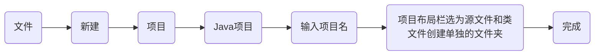
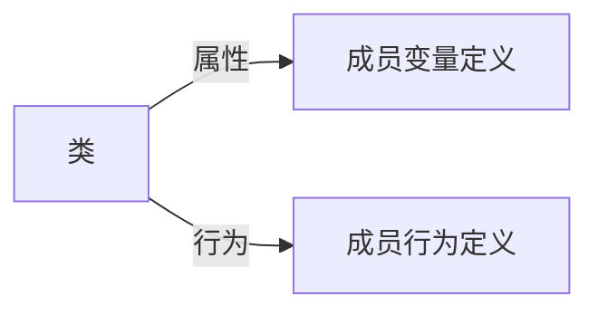
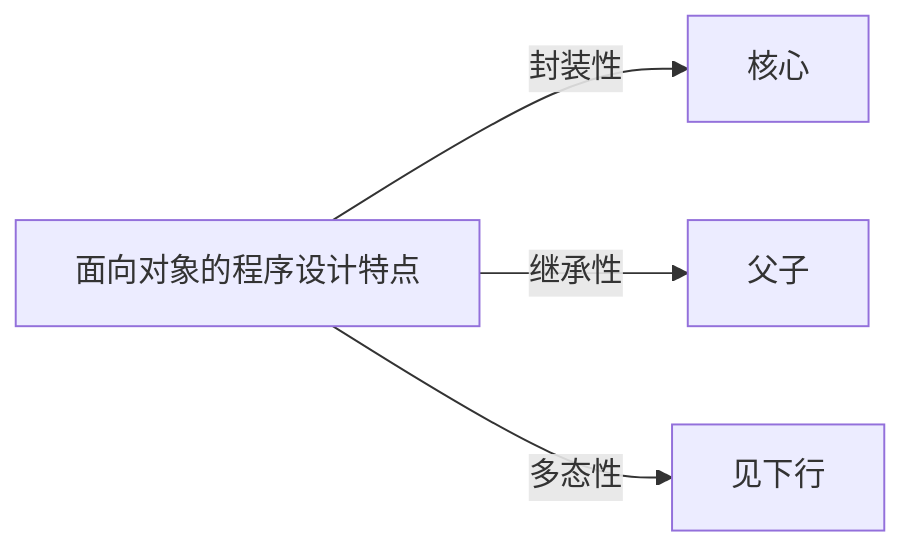
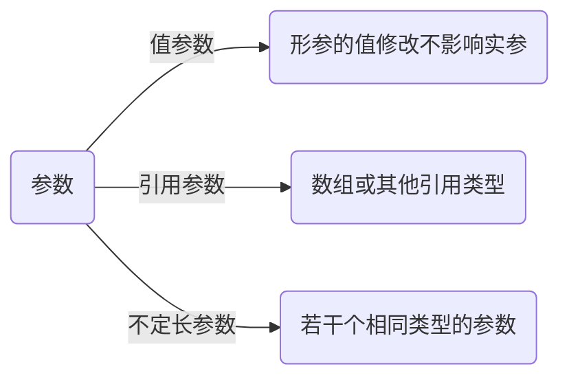
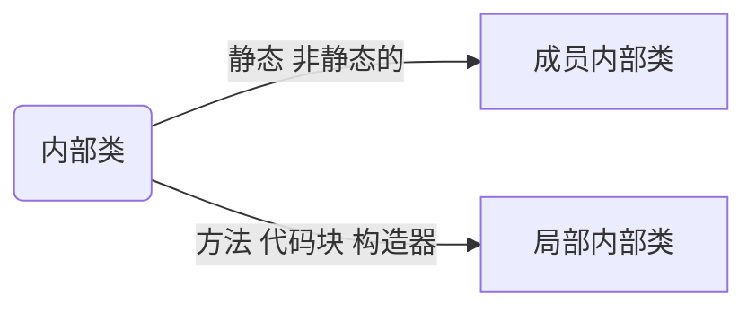

### 初识 Java

Java 是跨平台、面向对象的程序设计语言
Java语言编写的程序既是 <u>编译型</u> ，又是 <u>解释型</u> 的

1. 程序代码经编译之后转换为一种叫**Java字节码**的中间语言。
2. Java虚拟机（**JVM**）将对**字节码**进行解释和运行。

注意：

> 1. 编译只进行一次，而解释在每次运行程序时都会进行。
> 
> 2. 编译后的字节码采用一种针对JVM优化过的代码的形式保存，虚拟机将字节码解释成机器码，然后在机器上运行。

### Java报错

1. 运行时，带了.class后缀

如果你试图使用如下命令：

　　`E:\java\src>java HelloWorld.class`

> 系统会误认为你运行的是HelloWorld包下的名为class的类文件，会到系统的CLASSPATH下（一般都包括当前目录）企图寻找 HelloWorld.class.class这样的类，这样的类当然不存在了；并且也不可能存在，因为class是关键字，不能作为一个类的名字。所以 会报如下错误信息：

　　`Exception in thread "main" java.lang.NoClassDefFoundError: HelloWorld/class`

2. 文件名大小写错误

对于像Windows这样的系统，编译时可以不关心大小写。比如编译HelloWorld.java时，也可以使用：

　　`E:\java\src>javac helloworld.java`

也可以编译通过，但产生的类文件仍然是和源文件相符的：HelloWorld.class。

但在运行时一定要注意大小写，比如试图使用如下命令运行：

　　`E:\java\src>java helloworld`

将报类似于1中的错误：

`Exception in thread "main" java.lang.NoClassDefFoundError: helloworld (wrong name: HelloWorld)`

包含包层次的HelloWorld.java

比如上面的HelloWorld.java修改如下：

　 　`package org.javaresearch;`

```java
      public class HelloWorld

        {

          public static void main(String[] args)

          {

               System.out.println("Hello World!");

          }

       }
```

---

编译时有两种方法

1. 直接编译

　　`E:\java\src>javac HelloWorld.java`

此时在当前目录下输出HelloWorld.class。此时，运行不能使用上面相同的方法，使用：

　　`E:\java\src>java HelloWorld`

　　运行时，出现如下错误：

　　`Exception in thread "main" java.lang.NoClassDefFoundError: HelloWorld (wrong name: org/javaresearch/HelloWorld)`

> 从上述错误信息你也可以看到，系统可以找到HelloWorld类（因为当前路径包含在CLASSPATH中，具体为什么会提示wrong name，有兴趣的朋友参见Java语言规范），但这个类属于org.javaresearch包。所以，你要做的就是按照上述包层次，相应的创建目录层 次，把上面生成的HelloWorld.class放到E:\java\src\org\javaresearch\目录下。

  运行（**这时候是在包层次的最高层目录下运行的**）：

　　`E:\java\src >java org.javaresearch.HelloWorld`

　　系统打印出：

　　Hello World!

> 这儿要注意的是，不能使用java org\javaresearch\HelloWorld来运行，此时同样会出现如下错误：

　　`Exception in thread "main" java.lang.NoClassDefFoundErrorrg\javaresearch\HelloWorld (wrong name: org/javaresearch/HelloWorld)`

> 因为类名的书写是用句点来分割包名的层次的，引用java类库里面的类也可以这样写：java.util.List 类的全名就是这样的，我们如果在 import 语句里写上 import java.util.List;
> 
>  那么，就不用写全名了，直接写 List list = new ...;java 编译器就可以知道是 List 什么类。但是，由于java.util 这个包 和 java.sql 这个包都有一个 Date 类，所以如果同时导入这两个包，那么会导致java 编译器不知道引用哪个类，有两种解决办法：
> 
> a. 用全名来引用类：`java.util.Date date1 = ...;` `java.sql.Date date2 = ...;`
> 
> b. 不要导入整个包，只导入所需要的类，如果你同时需要这两个 Date 类，那么只能写全名了，如果你不是同时需要这两个类，你可以只导入需要的包：
> 
> 比如：`import java.util.List;` `import java.sql.Date;`
> 
> 这样就不会冲突，因为编译器可以十分清楚的区分
> 
> 这个 Date 类是 java.sql 包中的， java.util 包中的 Date 类根本就没有导入进来。
> 
> 这一点，可以按照常理来理解，还是比较好理解的。

2. 使用 -d 编译选项

> 是不是觉得上面的编译方法有点麻烦，能不能自动在当前路径（或任意指定的路径）下生成包层次呢？有！使用-d 编译选项就能做到。

　　`E:\java\src >javac -d . Hello.java`

> 其中的点表示当前目录。d 和 . 之间有空格， .和后面的java文件名之间也有空格
> 
> 此时，在当前目录下就生成了一个org\javaresearch目录，并且输出的.class文件也在里面。运行：

　　`E:\java\src >java org.javaresearch.HelloWorld`

　　系统打印：Hello World!

> 如果你想把生成的类文件集中存放在一个目录中，比如：E:\java\classes下，那么你首先创建这个目录，然后编译时：

　　`E:\java\src >javac -d E:\java\classes HelloWorld.java`

> 就可以把生成的类文件放到E:\java\classes目录下，并且按照包层次相应的创建目录路径。
> 
> 你可以在E:\java\classes\org \ javaresearch下找到HelloWorld.class文件。此时使用如下命令可以正确运行（注意如果要用到其它类，请在CLASSPATH中 设好）：

　　`E:\java\classes >java org.javaresearch.HelloWorld`

----

### Eclipse 使用

#### 创建Java项目

在eclipse中编写项目，必须要先创建项目
Java项目用于管理和编写Java程序。



完成项目的创建：

1. 源文件是写好的代码，后缀是 **.java**
2. 类文件是通过虚拟机编译后，后缀为 **.class**的文件，主要是给CPU看

#### 创建Java类文件


完成Java类文件的创建

#### 运行

**.Java** 文件右键运行方式——>**Java**运行程序

### 基本了解

1. 基本数据类型
   primitive主数据类型    
   `float   f = 35.2f`,
   
   除非加上`f`，否则所有小数点的值都会使Java当作double值处理

2. 运算符

3. 基本结构

4. 字符串

5. 数组

6. 正则表达式


 **Java 正则表达式学习**

 因特殊原因，无法展示图片，故想要了解更多具体内容，可前往[正则表达式](https://www.jb51.net/article/232314.htm)

**正则表达式之元字符**

元字符（Metacharacter）是一类非常特殊的字符，它能够匹配一个位置或者字符集合中的一个字符。 如`.`、`\w`等都是元字符。

刚刚说到，元字符既可以匹配位置，也可以匹配字符，那么我们就可以通过此来将元字符分为<u>匹配位置的元字符和匹配字符的元字符</u>。

> **<mark>匹配位置的元字符</mark>**
> 
> 匹配位置的元字符只有`^`（脱字符号）、`$`（美元符号）和`\b`这三个字符。
> 
> 分别匹配行的开始、行的结尾以及单词的开始或结尾。它们匹配的都只是位置。

**A匹配位置的元字符---^、$、\b**

**^匹配行的开始位置**

**^zzw匹配的是以"zzw"为行开头的"zzw"**

> 注意：我这里想要表达的是：尽管加了一个^，它匹配的仍是字符串，而不是一整行!
> 
> 如果zzw不是作为行开头的字符串，则它不会被匹配。


 **$匹配行的结尾位置**

如`zzw$`匹配的是以"zzw"为行结尾的"zzw"

> 注意：同样，这里$只是匹配的一个位置，那个位置是零宽度，而不是一整行
> 
> 如果zzw不是作为行的结尾，那么它不会被匹配


于是结合`^`和`$`我们就不难猜测`^zzw$`匹配的是某行中只有zzw这个字符串了。


> 而`^$`匹配的则是一个空行，这个空行中不包含任何字符串。

**\b匹配单词的开始或结束**

> `\bzzw`匹配的是zzw之前是空格符号、标点符号或换行符号的zzw,
> 
> 注意：但\b匹配的仅是一个零宽度的位置，而不会匹配空格、标点符号或换行符号
> 
> `zzw\b`匹配的是zzw之后是空格符号、标点符号或换行符号的zzw,
> 
> 同样，\b匹配的是一个零宽度的位置
> 
> 显然`\bzzw\b`匹配的就是zzw的前后必须是空格符号、标点符号或换行符号的zzw。


----

 **B匹配字符的元字符---. 、\w、\W、\s、\S、\d、\D**

匹配字符的元字符共有七个。

其中`.`（点号）表示匹配除换行符之外的任意字符；

- `\w` 匹配单词字符（不仅仅是字母，还有下划线、数字和汉字）；

- `\W`匹配任意的非单词字符（注意，与\w刚好相反）；

- `\s`匹配的是任意的空白字符（如空格、制表符、换行符、中文全角空格等）；

- `\S`匹配的是任意的非空白字符（注意：刚好和\s相反）；

- `\d`匹配任意的数字；

- `\D`匹配任意的非数字字符（注意：刚好和\d相反）。

- 例子如下：
  
  
  
  上面的四个例子从左到右依次表示：
  
  - `^.$`表示匹配一行中的唯一一个任意的非换行符的字符
  - `\ba\w\w\w\w\w\w\w\w\w\b`表示匹配以字母a开始的后面有9个字母字符的单词。 （注意：其中的a并不是元字符，就是一个普通的字符，我们称之为字符串字面值（string literal)-所谓字符串字面值，就是字面上看起来是什么就是什么）
  - `\b\w\w\w\d\d\d\d\D\b`表示匹配以3个字母字符开始后面紧跟着四个数字字符且最后一个不是数字字符的单词。

----

**正则表达式之文字匹配**

 **A、字符类**

字符类是正则表达式中的“迷你”语言，可以在`[]`中定义。

最简单的字符类可以由`[]`和`几个简单的字母`组成。

比如`[aeiou]`可以匹配`aeiou`五个字母中的**任意一个**。

`[0123456]`可以匹配`0123456`这七个数字中的**任意一个**。

`<H[123456]>`可以匹配到HTML标记中的`<H1><H2><H3><H4><H5><H6>`中的任意一个标记。

`[bhc]at`就会匹配字符串bat、hat、cat。也就是说字符类[]中的多个字符只会匹配其中一个。

> 但是显然[0123456]、<H[123456]>这样的表示太麻烦，需要写的很多，所以我们可以使用 `-`(连字符)来简写之，如[0-6]和<H[1-6]>。
> 
> 于是可知[0-9]和\d的作用是一样的。
> 
> `[a-z]`可以表示所有的小写字母，`[A-Z]`可以表示所有的大写字母。
> 
> `[a-zA-Z]`可以表示所有的大写字母和小写字母。

> 值得注意的是 `-`(连字符) 只有在字符类中的中间位置时才是“到”的意思。
> 
> 而`[-b]5`中`-`没有在两个字符之间，所以它表示的是`-5`或者`b5`，意思是要么匹配负号，要么匹配b

> 除此之外，我们知道^时只匹配行的开头，但是如果^出现在字符类中的第一个位置，那么它表示否定该字符类。
> 
> `[^123]`表示匹配不是数字1或2或3的其他任意字符。`[^-]`表示匹配不是`-`的任意字符。由此我们也可以发现：在字符类中使用元字符（-、^等）时，不需要进行转义运算。

更常用的有`[^aeiou]`匹配元音之外的字符、`[0-9a-zA-Z]`匹配任何数字、字母（大写和小写）和下划线，这等同于`\w`、`[^0-9a-zA-Z]`匹配任何非数字、字母（大写和小写）和下划线，这等同于`\W`


**B、字符转义**

> 我们知道元字符如`&`、`^`、`.`等都表示着特殊的涵义
> 
> 如果我们希望把他们看作一般的字符去匹配字符串，并且恰好他们又都不在字符类(如`[&]`中)，我们就需要使用`\`(反斜杠)进行转义了。

如我们可以使用www.jb51.net来匹配www.jb51.net。 我们可以用\*来匹配字符串中的*(通配符)。 我们还可以通过\\来匹配\。举例如下： 


**C、反义**

实际上我们在前面已经说过了，这里再说一遍是因为希望可以引起注意，

即`^`在字符类中的最前面时表示对这个字符类中的字符表示否定。

如`a[^b]`匹配a和a后面不是b的字符。又如`<asp[^>]>`表示匹配`<asp和其后面的字符不是>`的字符。举例如下：


----

**正则表达式之限定符**

什么是限定符呢?

 我们知道，在前面的例子中，曾经使用过`\ba\w\w\w\w\w\w\w\w\w\b`表示匹配以字母a开始的后面有9个字母字符的单词，显然这样写是十分麻烦的，如果我们能把\w这些重复的用简单的形式来写就好了。 没错，限定符就是干这个的，利用限定符我们可以重新写成`\ba\w{9}\b`。对，就是这么简单！

* `{n}` 表示重复n次，如\w{5}表示匹配5个单词字符。

* `{n,}` 表示重复至少n次，如\w{5}表示匹配至少5个单词字符,也可以是6个，7个……

* `{n,m}` 表示重复至少n次，最多m次，如\w{5,10} 表示匹配至少5个，最多10个单词字符。

* `*` 表示重复至少0次。 等同于`{0,}` ,即`hu*t`可以匹配<mark>ht</mark>或<mark>hut</mark>或<mark>huut</mark>或<mark>huuut</mark>……

* `+` 表示重复至少1次。 等同于`{1,}`，即`hu+t`可以匹配<mark>hut</mark>或<mark>huut</mark>或<mark>huuut</mark>……

* `?` 表示重复0次或1次。等同于`{0,1}`,即`colou?r`表示匹配<mark>color</mark>或者是<mark>colour</mark>。

上述的匹配都会尽可能多的匹配，可是有时候我们只需要匹配部分字符

那么如果我们在上面的限定符之后加上一个`?`呢 ,这时我们称之为**懒惰限定符**。 相应地，我们称上面几种匹配为**贪婪匹配**。

- `{n}？` 等同于{n}
- `{n,}？`  尽可能少的使用重复，但至少使用n次
- `{n,m}？` 重复n次到m次之间，但要尽可能少的使用重复。
- `*？` 尽可能少的使用重复的第一个匹配
- `+？` 尽可能少的使用重复，但至少使用1次
- `??` 使用零次重复（如果有可能）或者一次重复

对于`aabab`这个要 匹配的字符串而言，使用`a.*b`会匹配`aabab`，而如果使用`a.*?b`就会匹配`aab`和`ab`，而不是匹配所有。


**正则表达式之字符的运算**

**A.替换**

什么是替换呢? 显然就是指一个不行，我用另一个来替换

> `0\d{3}-\d{7}|0\d{2}-\d{8}` 就表示匹配前4位为区号、后7位为本地号码的电话号码，亦可匹配前3位为区号、后8位为本地号码的电话号码。`|` 表示的就是替换了。 `[Jj]ack`和`Jack|jack`的匹配效果是一样的都是用来匹配`Jack`或`jack`的。也就是说，替换|是或运算的关系。

> 在一般的或运算中0 0结果为0, 0 1结果为1， 1 0结果为1， 1 1结果为1。

> 那么在正则表达式中同样是这样，如果一个都匹配不上就不匹配；如果有一个能匹配上就匹配一个；如果两个都能匹配上，就匹配两个。 举例如下：


**B.分组**

正则表达式中，分组也是一个非常重要的概念。

看似复杂，实际上分组就是使用`(`和`)`，

即左圆括号和右圆括号将某些字符括起来看成一个整体来处理。

> 比如我们希望匹配`abcabc`。
> 
> 如果是`abc{3}`匹配的就是`abccc`，这不能达到预期，
> 
> 所以我们可以对abc分组，即`(abc){3}`就可以匹配到我们想要的字符串了。

> 又如`(\d{1,3}\.){3}\d{1,3}`也用了分组的运算方式，它可以用来匹配简单的IP地址，如下所示：


**C.反向引用**

> 上面我们通过()可以进行分组，而分组的同时，每一个组被自动赋予了一个组号，该组号可以代表该组的表达式。

编组的规则是：从左到右、以分组的左括号`(`为标志，第一个分组的组号为1，第二个分组的组号为2，以此类推。> 这时，反向引用就派上用场啦。我们就可以用它来**反向引用**使用`()`括起来的字符组了。

> 这时，反向引用就派上用场啦。我们就可以用它来**反向引用**使用`()`括起来的字符组了。具体怎么引用呢？规则如下：
> 
> 1. `\数字`，使用数字命名的反向引用。注：这个是通用的一种方式。
> 
> 2. `\k<name>`，使用指定命名的反向引用。注：这个是.NET Frameword支持的一种方式。
>    
>    下面的几个例子是使用数字命名的反向引用：


> 其中我们可以看到第一个和第二个匹配的并不相同---第一个匹配的是两个任意单词字符组成的单词，而第二个由于是使用了反向引用，那么它就必须是两个重复单词字符组成的单词。
> 
> 最后一个我使用了两个分组，根据分组规则可知\w{3}\d{2}是第一个分组，\d{2}是第二个分组。 同样注意：反向引用的是同样的字符，如www55www5566，最后两位不同，这就无法正确匹配了。

使用指定命名（也就是自定义命名）的反向引用

> 对于上面的第二个例子，我们用自定义命名的反向引用可以写成`\b(?<myName>\w)\k<myName>\b`或者是`\b(? 'myName' \w)\k<myName>\b`。
> 
> 当然，如果我们希望只是将之看作一个整体，而不希望给其编号，可以使用`(?:expression)`的方式。如下所示：


另外，下面几个也是常用的分组：

- `(?=expression)`匹配字符串expression前面的位置
- `(?!expression)`匹配后面不是字符串expression的位置
- `(?<=expression)`匹配字符串expresssion后面的位置
- `(?<!expression)`匹配前面不是字符串expression的位置
- `(?>expression)`只匹配字符串expression一次 

**D.零宽度断言**

> 之前介绍的^和$都是匹配的一个满足一定条件的位置。这里把满足的一个条件成为断言或零宽度断言。

常用的有：

- `^` 匹配行的开始位置
- `$`  匹配行的结束位置
- `\A`  匹配必须出现在字符串的开头
- `\Z`  匹配必须出现在字符串的结尾或字符串结尾处的\换行符好n之前
- `\z`  匹配必须出现在字符串的结尾
- `\G`  匹配必须出现在上一个匹配结束的地方
- `\b`  匹配字符的开始或结束位置
- `\B`  匹配不是在字符的开始或结束位置

> 之前所提到的`(?=expression)`、`(?!expression)`、`(?<=expression)`、`(?<!expression)`也都是匹配一个位置。

其中`(?=expression)`称为**零宽度预测先行断言**，它断言自身位置的后面能够匹配表达式expression。如`\b\w+(?=ed\b)`可以匹配以字符串`ed`结尾的单词的前面部分，如`reseted`中的reset。

其中`(?<=expression)`又称为**零宽度正回顾后发断言**，它断言自身位置的前面能够匹配表达式expression。如`(?<=\ban)\w+\b`可以匹配除字符串an之外的部分。


**E.负向零宽度断言**

`（?!expression)`称为**负向零宽度断言**，即断言自身位置的后面不能匹配字符串expression。

如`\b\w{3}(?!\d)`匹配的是后面不是数字的以三个单词字符开头的三个单词字符。如下所示：


**F.优先级顺序**

正则表达式中存在元字符、转义符、限定符、`|`等运算或表达式。

在匹配过程中，正则表达式都事先规定了这些运算或表达式的优先级。

正则表达式也可以像数学表达式一样来求值。也就是说，正则表达式可以从左到右、并按照一个给定的优先级来求值。

优先级顺序表(优先级由高到低)如下：

- 转义符：`\`
- 圆括号和方括号：`()`、`(?:)`、`(?=)`、`[]`
- 限定符： `*`、`+`、`?`、`{n}`、`{n,}`、`{n,m}`
- 位置和顺序：`^`、`$`、`\(元字符)`
- 或运算:`|`　　

我们可以看到`|`(或运算)的优先级是最低的。

**scanner**

```java
package JavaStudy;
   import java.util.Scanner;
public class scanner {
    public static void main(String[] args) {
        // TODO 自动生成的方法存根

        Scanner sc = new Scanner(System.in);
        System.out.println("请录入嫦娥个人信息：");
        System.out.println("请输入姓名：");
        String a  = sc.next();
        System.out.println("请输入年龄：");
        int b = sc.nextInt();
        System.out.println("请输入性别：");
        String c =sc.next();
        System.out.println("请输入体重：");
        float d = sc.nextFloat();
        System.out.println("请输入地址：");
        String e =sc.next();
        System.out.println("请输入是否已婚：");
        String f = sc.next();
        System.out.println("信息如下：");
        System.out.println("\t" + "姓名：" + a);
        System.out.println("\t" + "年龄：" + b);
        System.out.println("\t" + "性别：" + c);
        System.out.println("\t" + "体重：" + d);
        System.out.println("\t" + "地址：" + e);
        System.out.println("\t" + "婚否：" + f);


    }

}
```

----

### 面向对象编程基础

类是封装对象属性和行为的一个载体

而对象则是类抽象出来的一个实例。

<mark>类</mark>：事物抽象称呼，构造对象时所依赖的规范

<mark>对象</mark>：实体


---




---



> 多态性：为完成某个行为，不同的对象去玩完成时产成不同的状态，即一个行为具有不同的表现形式或形态的能力

----

### 类与对象

定义<mark>类</mark>用 **class** 关键字

```java
class 类名称{
     //类的成员变量
     //类的成员方法
}
```

#### 成员变量

定义与普通变量一样

常见默认值

| 数据类型                | 默认值   | 注释   |
|:-------------------:| ----- | ---- |
| 引用类型如String         | null  | 空值   |
| byte,int,short,long | 0     | 整型零  |
| float,double        | 0.0   | 浮点零  |
| char                | ' '   | 空格字符 |
| boolean             | false | 逻辑假  |

#### 成员方法

**定义**

   [权限修饰符] [返回值类型] 方法名（[参数类型 参数名]）[throws 异数类型]{
   ...                //方法体
   return  返回值
   }

> 权限修饰符：可以是private ,public ,protected 的任一个，也可不写，主要用来控制方法的访问权限
> 返回值类型：指定方法返回值的类型，若不需要返回值，用void
> 参数：可有可无，可以为对象也可为变量

**示例**

```java
public void showGoods(){
     System.out.println("商品名称")
     System.out.println("FullName")
}
```

<mark>注意</mark>：
方法的定义必须在某个类中
若没有指定的权限修饰符，方法的访问权限为默认，即只能在本类及同一个包的类中进行访问
若定义的方法有返回值，必须返回值类型与方法返回的值类型<mark>一致</mark>

**参数**



----

#### 成员方法的使用

```java
public class Leopard {
    public void gaze (String target) {
//        凝视，参数是target    
        System.out.println("猎豹凝视" + target);
    }
    public void run() {//奔跑
        System.out.println("猎豹开始奔跑");
    }
    public boolean catchPrey (String prey) {//捕捉是否成功，返回捕捉是否成功
        System.out.println("猎豹开始捕捉"  + prey);
        return true;
    }
    public void eat (String meat) {
        System.out.println("猎豹吃"+meat);
    }
    public void sleep() {
        System.out.println("猎豹睡觉");
    }

    public static void main(String[] args) {

        // TODO 自动生成的方法存根
        Leopard liebao = new Leopard();
        liebao.gaze("羚羊");
        liebao.run();
        liebao.catchPrey("羚羊");
        liebao.eat("羚羊肉");
        liebao.sleep();
    }

}
```

#### 构造方法

主要用于<mark>创建对象</mark>，与类同名

**一个对象建立后，构造函数仅只运行一次。**

**如果想给对象的值再赋新的值，就要使用set和get方法，此时是当做一般函数使用**

**无参构造函数**

```java
package javastudy;

public class ConfunDemo {
    public static void main(String[] args) {
        //输出Hello World。new对象一建立，就会调用对应的构造函数Confun()，并执行其中的println语句。
        Confun c1=new Confun();            

    }
}
class Confun{        
    Confun(){        
        //定义构造函数，输出Hello World
        System.out.println("Hellow World");
    }
}
```

**有参构造函数**

在new对象时，将实参值传给private变量，相当于完成setter功能。

```java
package javastudy;

public class ConfunDemo3 {
    public static void main(String[] args){
        //实例化对象时，new Person()里直接调用Person构造函数并转转实参，相当于setter功能
        Person z = new Person("aerchi",18); 
        z.show();
    }
}

class Person{
    private String name;
    private int age;
    //有参数构造函数，实现给private成员变量传参数值的功能
    public Person(String n,int m){ 
        name=n;
        age=m;        
    }
    //getter                                      
    //实例化对象时，完成了sett功能后，需要getter，获取实参值。
    public String getName(){
        return name;
    }
    public int getAge(){
        return age;
    }

    //获取private值后，并打印输出
    public void show(){
        System.out.println(name+"\n"+age);
    }
}
```

特点：

1. 构造方法没有返回类型，也不能定义为void

2. 构造方法名称要与类名相同,new对象时，就调用与之对应的构造函数，执行这个方法。不必写“.方法名”

3. （不重要）构造方法的主要作用是完成对象的初始化工作，能把定义对象的参数传给对象成员
   说明：在定义构造方法时，构造方法无返回值，但与普通无返回值的方法不同，
     public void method()形式定义
     构造方法不需要使用void关键字
   
   ```java
   class Book{
                        public Book( ){       //构造方法
             }
      }
   ```
   
   > 注：只有在类中没有定义任何构造方法时，编译器才会在该类中**自动创建**一个<mark>不带参数</mark>的构造方法。若在类中定义的方法都是有参构造方法，编译器不会自动创建无参构造方法。构造方法可用`private`修饰，即**私有的构造方法**，无法使用new创建对象，需要使用静态方法生成类的对象

#### 局部变量

即成员方法内定义的变量

> 方法被执行时创建，执行结束时被销毁
> 使用时必须初始化或赋值

类的<u>成员变量</u>和<u>成员方法</u>可用统称为<u>类成员</u>

> 若一个方法中含有与成员变量同名的局部变量，则方法对这个变量的访问以局部变量进行

> 作用域：从变量的声明开始到该变量的结束为止

#### 创建对象

通过**new操作符**
每实例化一个对象就会自动调用一次构造方法
new操作符**调用**构造方法创建对象,创建对象需要以下三步：

- **声明**：声明一个对象，包括对象名称和对象类型。
- **实例化**：使用关键字 new 来创建一个对象。
- **初始化**：使用 new 创建对象时，会调用构造方法初始化对象。

```java
public class Puppy{
   public Puppy(String name){
      //这个构造器仅有一个参数：name
      System.out.println("小狗的名字是 : " + name ); 
   }
   public static void main(String[] args){
      // 下面的语句将创建一个Puppy对象
      Puppy myPuppy = new Puppy( "tommy" );
   }
}
```

#### 访问对象的属性和行为

```java
/* 实例化对象 */
Object referenceVariable = new Constructor();
/* 访问类中的变量 */
referenceVariable.variableName;
/* 访问类中的方法 */
referenceVariable.methodName();
```

实例

```java
public class Puppy{
   int puppyAge;
   public Puppy(String name){
      // 这个构造器仅有一个参数：name
      System.out.println("小狗的名字是 : " + name ); 
   }

   public void setAge( int age ){
       puppyAge = age;
   }

   public int getAge( ){
       System.out.println("小狗的年龄为 : " + puppyAge ); 
       return puppyAge;
   }

   public static void main(String[] args){
      /* 创建对象 */
      Puppy myPuppy = new Puppy( "tommy" );
      /* 通过方法来设定age */
      myPuppy.setAge( 2 );
      /* 调用另一个方法获取age */
      myPuppy.getAge( );
      /*你也可以像下面这样访问成员变量 */
      System.out.println("变量值 : " + myPuppy.puppyAge ); 
   }
} 
```

### this关键字

> 当类中的成员变量与成员方法中的参数**重名**时，方法中如何使用成员变量?

this  的作用：

1. 在实例方法和构造方法中使用this
2. 区分成员变量和局部变量
3. 返回对实例对象本身的引用
4. 使用this调用类的其他构造方法
   `this（Height）；//调用构造方法Height`

```java
package JavaStudy;

public class Book2 {
    String name ="abc";
    public void showName(String name) {
        System.out.println(this.name);//在方法中显示成员变量
    }

public static void main (String[]  args) {
    Book2 book = new  Book2();
    book.showName("123");
   }
}
```

### static关键字

静态成员**只属于类所有**，区别于对象

**静态变量**

不同的类需要对同一个变量进行操作
`类名.静态类成员`
定义: `static int water = 0`;
调用: `Pool.water`

```java
package JavaStudy;
public class Pool {
    static public int water =0;
    public void outlet() {//放水，一次2单位
        if(water>=2)
        {
            water=water-2;
        }else {
            water=0;
        }
    }//放水行为完毕
    public void inlet() {//注水，一次3单位
        water=water+3;

    }

    public static void main(String[] args) {
        // TODO 自动生成的方法存根
        Pool out = new Pool();
        Pool in = new Pool();
        System.out.println("水池的水量：" + Pool.water);
        System.out.println("水池注水两次");
        in.inlet();
        in.inlet();
        System.out.println("水池放水一次");
        out.outlet();
        System.out.println("水池的水量：" + Pool.water);
    }
}
```

> 注：同一个类的不同实例对象共用同一静态变量，若一个类将其更改，另一个类静态变量也会更改
> 即a.x的值不是我们赋予的初值，而是最后一次b.x的值

当类首次被加载时，静态变量就被分配到内存中，直到程序结束才能释放
使用`satsic`关键字访问对象的属性，可以通过 `类名.属性名` 直接访问，不需要创建对象
**静态方法不能直接访问非静态变量，不能直接调用普通方法**
**局部变量也不能用static修饰**

 **静态常量**（所有字母均大写）

共享一个数据常量

```java
package JavaStudy;
public class Graphical {
    final static double PI = 3.1415926;//创建静态常量π
    public static void main(String[] args) {
        // TODO 自动生成的方法存根
        double radius =3.0;//定义半径
        double area = Graphical.PI * radius * radius;//定义面积
        double volume = 4 / 3*(Graphical.PI * radius * radius * radius);
        Circular yuan = new Circular (radius,area);
        Spherical qiu = new Spherical (radius,volume);
    }//主方法

}//
class Circular{
    double radius;//定义半径
    double area;//定义面积
    public Circular(double radius,double area) {
        this.area=area;
        this.radius=radius;
        System.out.println("圆的半径是"+radius+"\n"+"圆的面积是"+area);
    }
}//圆类
class Spherical{
    double radius;
    double volume;
    public Spherical(double radius,double volume) {
        this.radius=radius;
        this.volume=volume;
        System.out.println("球的半径是"+radius+"\n"+"球的体积是"+volume);
    }
}//球类
```

```java
//控制台输出
final static double PI = 3.1415926 ;
```

 **静态方法**

调用类的静态方法，无需创建类的对象
`类名.静态方法();`

```java
package JavaStudy;
public class StaticMethod {
    static public void show () {
        System.out.println("静态方法无需实例化就可以调用");
    }

    public static void main(String[] args) {
        StaticMethod.show();//使用类名调用静态方法
    }

}
```

**静态代码块**

以static修饰的代码块区域

```java
public class StaticStudy{
     static{     
                //此处编写静态代码
        }
}
```

定义一块静态代码块，可以完成**类的初始化操作**，在**类声明**时就会运行

> 注：

1. 静态代码块由始至终只运行一次
2. 非静态代码块 每次在创建对象的时候，会在构造方法之前运行，默认值为null
3. 构造方法只有使用new创建对象时才运行
4. 成员方法只有使用对象调用时才运行

### 类的主方法

主方法是类的入口点，定义了程序从何处开始
主方法提供了对程序流向的控制

```java
 public static void main(String[] args){
  //方法体
}
```

1. 主方法是静态的，直接在主方法中调用其他方法，该方法也必须是静态的
2. 主方法无返回值

主方法的形参为数组，其中args[0]~args[n]分别代表程序的第一个参数到第n+1个参数。`arg.length`获取参数个数

### 类的封装

将对象的行为和属性封装起来，其载体就是类
<u>数据的隐藏与开放</u>对外的接口可以通过**访问权限控制符**来实现

#### public

public 访问权限最具开放性，修饰为public的类成员变量和方法，可以在其他类中无限制地访问该成员

#### protected

protected 可用来修饰类的成员变量或方法，具有protected访问特性的类成员可以被本类，本包中的其他类访问，也可以被其他包的子类继承

#### 默认

没有指定访问权限控制符，具有默认权限的类，接口，成员变量，成员方法，只能被本类和同一个包中的其他类，接口及成员方法引用，因此，默认权限也称为包权限

#### private

私有访问控制符private 用来声明类的私有成员，用private修饰的成员变量或方法只能被该类自身所访问和修改，而不能被任何其他类（包括该类的子类）来获取和引用

### 类的继承

继承可以使用 `extends` 和 `implements` 这两个关键字来实现继承，而且所有的类都是继承于 `java.lang.Object`，当一个类没有继承的两个关键字，则默认继承object（这个类在 **java.lang** 包中，所以不需要 **import**）祖先类。

#### extends关键字

在 Java 中，类的继承是单一继承，也就是说，一个子类只能拥有一个父类，所以 extends 只能继承一个类！

```java
public class Ipad extends Computer{
  //Ipad 子类继承Computer 父类
}
```

```java
public class Animal { 
    private String name;   
    private int id; 
    public Animal(String myName, String myid) { 
        //初始化属性值
    } 
    public void eat() {  //吃东西方法的具体实现  } 
    public void sleep() { //睡觉方法的具体实现  } 
} 

public class Penguin  extends  Animal{ 
}
```

#### 方法的重写

重写：子类继承父类以后，可以对父类中同名同参的方法，进行覆盖操作

应用：重写以后，当创建子类对象以后，通过子类对象调用父类中的同名同参的方法时，实际执行的是子类重写父类的方法。

```java
public class PersonTest {
    public static void main(String[] args) {
        Student s=new Student("计科");
        s.eat();
        s.walk(10);
        System.out.println("*********");
        s.study();

        Person p1=new Person();
        p1.eat();

    }
}

public class Person {

    String name;
    int age;

    public Person() {

    }

    public Person(String name,int age) {
        this.name=name;
        this.age=age;
    }

    public void eat() {
        System.out.println("吃饭");
    }

    public void walk(int distance) {
        System.out.println("走了"+distance+"米长的路");
        show();
        eat();
    }

    private void show() {
        System.out.println("我是一个人");
    }

    public Object info() {
        return null;
    }

    public double info1() {
        return 1.0;
    }

}

public class Student extends Person{

    String major;

    public Student() {

    }

    public Student(String major) {
        this.major=major;
    }

    public void study() {
        System.out.println("学习"+major+"专业");
    }
    //    对父类eat方法重写
    public void eat() {
        System.out.println("学生应该多吃有营养的食物");
    }
    public void show() {
        System.out.println("我是一个学生");
    }

    public String info() {
        return null;
    }

    public void walk(int distance) {
        System.out.println("重写的方法");
    }
}
```

#### implement关键字

使用 implements 关键字可以变相的使java具有多继承的特性，使用范围为类继承接口的情况，可以同时继承多个接口（接口跟接口之间采用逗号分隔）。

```java
public interface A {
    public void eat();
    public void sleep();
}

public interface B {
    public void show();
}

public class C implements A,B {
}
```

#### super  关键字

子类继承父类时，可能会出现<u>变量隐藏和方法覆盖</u>等问题；
super关键字：我们可以通过super关键字来实现对父类成员的访问，用来引用当前对象的父类。

this关键字：指向自己的引用。

```java
class Animal {
  void eat() {
    System.out.println("animal : eat");
  }
}

class Dog extends Animal {
  void eat() {
    System.out.println("dog : eat");
  }
  void eatTest() {
    this.eat();   // this 调用自己的方法
    super.eat();  // super 调用父类方法
  }
}

public class Test {
  public static void main(String[] args) {
    Animal a = new Animal();
    a.eat();
    Dog d = new Dog();
    d.eatTest();
  }
}
```

```java
//控制台输出
animal : eat
dog : eat
animal : eat
```

#### 子类对象的构造

当用子类的构造方法创建一个子类对象时，子类的构造方法总会**显式或隐式**地先调用父类的某个构造方法。

> 如果子类的构造方法没有明指向调用父类的哪个构造方法，Java会默认调用父类的无参构造方法。
> 子类也可以通过**super关键字**显示调用父类指定的构造方法，具体调用哪个构造方法需要根据super()的参数类型决定。

```java
package JavaStudy;
class SuperClass{
    private int n;
    SuperClass(){
        System.out.println("SuperClass()");
    }
    SuperClass(int n){
        System.out.println("SuperClass(" + n + ")");
     this.n = n;
    }
}
class SubClass extends SuperClass{
    private int n;
    SubClass (int n){
        super(); //调用父类构造方法
        System.out.println("SubClass(" + n + ")");
        this.n = n;
    }
    SubClass(){
        super(300);
        System.out.println("SubClass()");
    }
}

public class SuperUse {

    public static void main(String[] args) {
        // TODO 自动生成的方法存根
        SubClass sc1 = new SubClass();
        SubClass sc2 = new SubClass(400);

    }

}
```

```java
 //控制台输出
SuperClass(300)
SubClass()
SuperClass()
SubClass(400)
```

> 子类创建时，系统默认自动调用父类的无参构造方法。super（300)的参数类型是整型，显式调用了父类的SuperClass(int n)构造方法。
> **特别注意**：
> 
> 若父类定义了有参数的构造方法，系统就不再提供默认的无参构造方法，此时子类一定要避免使用父类的无参构造方法。

#### 所有类的父类

**——Object类**

继承原理，Java里所有的类都直接或间接继承java.lang.Obect 类，除非这个类指定要从其他类继承
都可以重写Obect类的方法

----

几种常见的Object类中的方法

* getClass() 方法
  getClass()方法是Object定义的方法
  返回对象执行时Class实例
  调用getName()方法利用取得类的名称

```java
class  Person2{
    int id ;
    private String name;
    public Person2(int id,String name){
        super();
        this.id = id ;
        this.name = name;
    }
}
public class GetClass {
    public static void main(String[] args) {
        Person2 p = new Person2(1,"zbd");
        System.out.println(p.getClass());
        System.out.println(p.getClass().getName());
        System.out.println(p.getClass().getSimpleName());
        System.out.println(p.id);
    }
}
```

```java
class com.first.Person2
com.first.Person2
Person2
1
```

* toString() 方法
  将一个对象返回为字符形式，为对象提供一个特定的输出形式

* equals()方法
  `==`比较的是两个对象的引用方式是否相等，`equals`方法比较的是两个对象的实际内容

```java
public class  V{
    public static void main(String[] args) {
        String s1 = "123";
        String s2 = "123";
        System.out.println(s1 == (s2));
        System.out.println(s1.equals((s2)));
        V v1 = new V();
        V v2 = new V();
        System.out.println(v1.equals(v2));
    }
```

```java
true
true
false
```

### 类的多态

多态性是指“一种定义，多种实现”

多态的优点

- 1. 消除类型之间的耦合关系
- 2. 可替换性
- 3. 可扩充性
- 4. 接口性
- 5. 灵活性
- 6. 简化性


两方面体现:

1. 方法的重载        
2. 类的上下转型，方法覆盖   

#### 方法的重载

方法的重载就是在同一个类中允许同时存在一个以上的同名方法，只要这些方法的参数个数或类型不同即可

```java
public class  OverLoadTest{
    //定义一个方法
    public static int add (int a){
        return a;
    }
    //定义一个与第一个方法 参数不同 的方法
    public static int add(int a,int b){
        return a+b;
    }
    //定义一个与第一个 相同名称 ，参数类型不同 的方法
    public static double add(double a,double b){
        return a+b;
    }
    public static int add(int a,double b){
        return (int)(a+b);
    }
    //参数序列不同
    public static int add(double a,int b){
        return (int)(a+b);
    }
    public static int add (int... a){
        int s = 0;
        for (int i = 0;i < a.length;i++){
            s += a[i];
        }
        return s;
    }

    public static void main(String[] args) {
        System.out.println("调用add（int）方法：" +add(1));
        System.out.println("调用add（int int）方法：" + add(1,2));
        System.out.println("调用add（double double）方法：" + add(2.1,3.4));
        System.out.println("调用add（int double）方法：" + add(2,1.1));
        System.out.println("调用add（double，int)方法："+ add(2.1,3));
        System.out.println("调用add（int... a）方法：" + add(1,23,4,5,6,7,4));
    }
}
```

```java
调用add（int）方法：1
调用add（int int）方法：3
调用add（double double）方法：5.5
调用add（int double）方法：3
调用add（double，int)方法：5
调用add（int... a）方法：50
```

>  **重载和重写是两个不一样的概念**
>  重载主要利用一个类内实现若干个重载的方法，这些方法的名称相同而参数形式不同，
> 
> 而重写主要是用于子类继承父类时，重新实现父类的非私有方法。

#### 向上转型

```java
 class Quadrangle {
    public static  void draw (Quadrangle q){
        System.out.println("打印");
    }
}
public class Parallelogram extends Quadrangle{
    public static void main(String[] args) {
        Parallelogram p = new Parallelogram();
        draw(p);
    }
}
```

```java
打印
```

> 平行四边形类继承了四边形类，四边形类有一个draw方法，ta的参数是Quadrangle（四边形类)，
> 而在平形四边形类的主方法中调用draw（）时，传给的<mark>参数</mark>却是Parallelograme（平行四边形类），
> 这里强调一下，因为平行四边形也是一种四边形，因此可以将平行四边形的对象看作四边形的对象，也就相当于`Quadrangle obj = new Parallelograme`，就是把子类对象赋值给父类类型的变量，这种技术就叫做“向上转型”

----

#### 向下转型

向下转型是将抽象的类转换成具体的类，但是这样的转型通常会出现问题

> 比如你不能说所有的鸟都是鸽子，所有的四边形都是平行四边形，这非常不合逻辑

如果将父类对象直接赋予子类，会发生**编译器错误**

```java
class Quadrangle {
    public static  void draw (Quadrangle q){
        System.out.println("打印");
    }
}
public class Parallelogram extends Quadrangle{
    public static void main(String[] args) {
       draw (new Parallelogram());
    //   向上转型
        Quadrangle q = new Parallelogram();
        Parallelogram p = q; //会报错    
//Error:(18, 27) java: 不兼容的类型: com.first.Quadrangle无法转换为com.first.Parallelogram
    }
}
```

>  所以我们有必要告诉编译器这个四边形是平行四边形，将父类对象强制转换成某个子类对象，这种方式叫做**显示类型转换**

```java
 class Quadrangle {
    public static  void draw (Quadrangle q){
        System.out.println("打印");
    }
}
public class Parallelogram extends Quadrangle{
    public static void main(String[] args) {
       draw (new Parallelogram());
    //   向上转型
        Quadrangle q = new Parallelogram();
        Parallelogram p = (Parallelogram) q;
    }
}
```

#### 方法覆盖

方法重载指一个类中可以有多个方法具有多个相同的名字，但这些方法的参数不相同。

参数不同具体为参数的个数不相同，或者参数的类型不相同。
**方法覆盖**指子类的方法名与父类的方法名完全相同，方法的返回值类型，入口参数的数目，类型，顺序均相同，只是方法实现的功能不同，此时父类的方法被覆盖。

#### instanceof 关键字

在执行向下转型操作时，判断父类对象是否为子类对象的实例尤为重要，这时候就需要instanceof操作符来完成
instanceof操作符的语法格式：

```java
myobject instanceof ExampleClass
```

`myobject` : 某个类的对象引用
`ExampleClass `: 某个类

```java
package JavaStudy;
class Quadrangle {
//    Something
}
class Square extends Quadrangle{
//    Something
}
class Anything {
//    Something 
}

public class Paeallelogram extends Quadrangle {

    public static void main(String[] args) {
        // TODO 自动生成的方法存根
        Quadrangle q  = new Quadrangle();//实例化父类对象
//        判断父类对象是否为Paeallelogram子类的一个实例
        if ( q instanceof Paeallelogram) {
            Paeallelogram p =(Paeallelogram)q;//进行向下转型
        }
//        判断父类对象是否为Paeallelogram子类的一个实例
        if (q instanceof Square) {
            Square s = (Square) q;//进行向下转型
        }

    }

}
```

使用`instanceof`操作符的表达式返回值是布尔值，`true`的话，就意味着`myobject`对象是 `ExampleClass`类的实例化对象

> instanceof 是Java里的关键字，在Java里关键字都是**小写**

### 非访问控制符

#### static

被static修饰的类成员变量或成员方法分别称其为 **类变量**（**静态变量**） 和 **类方法**（**静态方法**）
没有被static修饰的类成员变量或成员方法称为 **实例变量** 或 **实例方法**

1. 类变量
   
   * 实例对象依附于对象，使用new关键字创建对象时 ，Java运行系统为每个对象分配一个内存空间，不同的实例变量占用不同的内存区域。
   
   * 类变量依附于类（而非对象），对于类变量来说，Java运行系统为类的类变量分配公共的存储空间，该类的每个实例对象共享同一个类变量的存储空间。因此，每个对象对类变量的修改都会影响其他实例对象。
   
   * 类变量可以通过类名直接访问，而不需要创建对象
   
   * 任何一个对象对类变量的修改，都是在同一个内存单元上完成的，因此，每个对象对类变量的修改都会影响其他实例对象。

2. 类方法
   
   * 类方法的本质就是该方法属于整个类，而不是属于某个实例，直接可以通过类名调用
   
   * 类方法内<mark>不能使用</mark>this关键字，因为静态方法不属于任何一个实例

#### final

可用来修饰类，类的成员变量，类的成员方法，

被final修饰的类，成员变量，成员方法均不允许继承或覆盖

1. final修饰类
   
   * final修饰类，说明这个类就是最终类，不可能有子类，有子类就意味着可以定义新成员。
     Java API中有不少类定义为final的类，这些类通常有固定作用，用来完成某种标准的类，如Math类，String类，Integer类等
   
   * abstract和final修饰符不能同时修饰一个类，但是可以和其他的修饰符合用

2. final修饰成员变量
   用final修饰的成员变量为常量，不允许修改

3. final修饰成员方法
   
   * 用fianal修饰的成员方法时功能和内部语句不能被更改的最终方法
   
   * final类中的所有成员变量和成员方法都会默认为final的。

#### 其他修饰符

1. volatile
   易失变量，通常这个变量同时被几个线程控制和修改
2. native
   用native修饰的方法是一种特殊方法，一般用来声明其他语言正在外部编写的方法题并实现方法功能。由于native的方法是用其他语言在外部编写的，因此所有的native方法都没有方法体，而使用一个`;` 代替。
3. synchronized
   主要用于对多线程程序的协调与同步
   如果一个方法被`synchronized `关键字修饰，意味着不管哪一个线程运行到这个方法时，都要检查有没有其他线程正在使用这个方法，
   若有，则要等正在使用synchronized 方法的线程完成这个方法后，再运行此线程；
   若没有，则直接运行。

### 抽象类与接口

#### 抽象类

语法：

```java
[权限修饰符] abstract 方法返回值类型 方法名 （参数列表）{
           // 类体
} 
```

抽象类除了**被继承**之外没啥意义

1. 包含抽象方法的类一定是抽象类，但是抽象类不一定必须包含抽象方法。

2. 抽象类不能别实例化，不能使用new关键字实例化对象，会导致编译错误

3. 抽象方法属于一种不完整的方法，只含有一个声明部分，没有方法主体

4. 抽象方法的继承：若一个类要继承抽象类，则给类必须实现抽象类中定义的所有抽象方法，否则，该类必须修饰为抽象类
   
   ```java
   abstract class Animal {
      String eyecolor;
      String furcolor;
      int age;
   
      public Animal(){   //构造方法，初始化age
       age = 0;
     }
      abstract void eat();//抽象方法吃
      abstract void run();//抽象方法跑
   }
   ```

#### 抽象方法

语法：

```java
[权限修饰符] abstract 方法返回值类型 方法名 （参数列表）;
```

可以发现，抽象方法是直接以分号结尾，它没有方法体，也就是说抽象方法本身没有什么意义，除非它被重写。

> 构造方法不能定义为抽象方法

#### 接口

接口其实就是抽象类的延伸

抽象类有成员方法和成员变量，接口却只有常量和抽象方法
这就意味这接口中的成员变量必须初始化，同时接口中的所有方法必须声明为abstract方法，方法只被定义而没有实现

**interface 关键字定义**
在接口中定义的任何变量都自动是 **static** 和 **final** 的，因此，在接口中定义变量时，必须初始化，而且<u>实现接口的子类不能对接口中的变量重新赋值</u>。

```java
[修饰符] interface 接口名 [extends 父接口名列表]{
    [public] [static] [final] 常量;
    [public] [abstract] 方法;
}
```

一个类实现接口使用implements关键字
`A implements B,C,D//多继承`

```java
interface drawTest{
    //定义接口
    public void draw();
}
//定义平行四边形实现接口
class ParallelogrameleUseInterface implements drawTest{
    public void  draw(){
        System.out.println("平行四边形.draw()");
    //    由于该类实现了接口，所以需要覆盖draw（）方法
    }
}
class SquareUseInterface implements drawTest{
    public void draw(){
        System.out.println("正方形.draw()");
    }
}
class QuardrangleUseInterface {
//    实现四边形类
public static void main(String[] args) {
    drawTest[] d = {//接口也实现向上转型
            new SquareUseInterface(),new ParallelogrameleUseInterface() };
    for (int i=0;i<d.length;i++){
        d[i].draw();
    }
}
}
```

```java
//控制台输出
正方形.draw()
平行四边形.draw() 
```

#### 多重继承

使用接口可以实现多重继承

```java
class 类名 implements 接口1,接口2,...,接口n
```

```java
interface IFather { //定义一个接口
    void smoking();
    void goFishing();
}
interface IMother { //定义一个接口
    void watchTV();
    void cooking();
}
public class Me implements IFather,IMother {
//    重写方法
    public void watchTV() {
        System.out.println("我喜欢看电视");
    }
    public void cooking() {
        System.out.println("我喜欢做饭");
    }
    public void smoking() {
        System.out.println("我不喜欢抽烟");
    }
    public void goFishing() {
        System.out.println("我喜欢钓鱼");
    }

    public static void main(String[] args) {
        //通过子类创建IFther的接口对象
        IFather father = new Me();
        System.out.println("爸爸的爱好：");
        father.smoking();
        father.goFishing();
        IMother mother = new Me();
        System.out.println("妈妈的爱好：");
        mother.cooking();
        mother.watchTV();
    }
}
```

```java
爸爸的爱好：
我不喜欢抽烟
我喜欢钓鱼
妈妈的爱好：
我喜欢做饭
我喜欢看电视
```

> 使用多重继承是，可能会出现变量名或方法名冲突的情况，
> 若变量冲突，明确指定变量的接口，通过`接口.变量`实现
> 若方法冲突则只要实现一个方法即可

接口继承接口，使用extends关键字

```java
interface Father{           //定义父接口
    void fatherMethod();    //父接口方法
}
interface Child extends Father{ //定义子接口，继承父接口
    void childMethod();         //子接口方法
}
public class InterfaceExtends implements Child{ //实现子接口，但必须重写所有方法
    public void fatherMethod(){
        System.out.println("实现父类接口方法");
    }
    public void childMethod(){
        System.out.println("实现子类接口方法");
    }

    public static void main(String[] args) {

    }
}
```

#### 抽象类与接口

> 抽象类是对根源的抽象，接口是对动作的抽象。

定义抽象类的代价太高了，因为每个类只能继承一个抽象类，在这类中，必须继承或编写出其子类的所有共性。
而接口在功能上弱化了许多，虽然只是针对一个动作的描述，但可以在一个类中实现多个接口

| 比较   | 抽象类             | 接口             |
|:----:|:---------------:|:--------------:|
| 方法   | 可以有非抽象方法，比如构造方法 | 所有方法都是抽象方法     |
| 属性   | 属性中可以有非静态常量     | 所有属性都是静态常量     |
| 构造方法 | 有               | 没有             |
| 继承   | 一个类只能继承一个父类     | 一个类可以同时实现多个接口  |
| 被继承  | 一个类只能继承一个父类     | 一个接口可以同时继承多个接口 |

----

### 内部类

汽车里的发动机



#### 成员内部类

1. 作为外部类的成员
   
   > 调用外部类的结构
   > 
   > 可以被4种不同的权限符修饰

2. 作为一个类
   
   > 类内可以定义属性，方法，构造器等
   > 可以被final，abstract修饰
   
   关注3个问题
   
   1. 如何实例化成员内部类的对象
   
   2. 如何在成员内部类中区分外部类的结构
   
   3. 局部内部类的使用
      实例：
   
   ```java
   public class Person {
       String name = "人的名字";
       int age ;
       void eat() {
       System.out.println("人，吃饭");
       }
   static class bird{ 
       String name;
       int age;
       void sing() {
           System.out.println("小鸟唱歌");
       }
   }
   class dog{
       String name="狗的名字tom";
       int age;
       void show() {
           System.out.println("tom是一只狗");
       }
       public void display(String name) {
           System.out.println(name);//方法的形参
           System.out.println(this.name);//内部类的属性
           System.out.println(Person.this.name);//外部类的属性
       }
   }
   
   public static void main(String[] args) {
   // 实例化 静态成员内部类
       Person.bird bird = new Person.bird();
       bird.sing();
   // 实例化 非静态成员内部类
   // 得先创建一个外部列对象，让内部类对象依赖于外部类存在
       Person p = new Person();
   // Person.dog dog = new p.dog(); 这样会报错
       Person.dog dog = p.new dog();
       dog.show();
       dog.display("快乐");
       }
   }
   ```
   
   ```java
   //控制台输出
   小鸟唱歌
   tom是一只狗
   快乐
   狗的名字tom
   人的名字
   ```

​     普通内部类对象依赖于外部类对象而存在，即在创建一个普通内部类对象时首先需要创建其外部类对象。

```java
public class InnerClassTest {

    public int outField1 = 1;
    protected int outField2 = 2;
    int outField3 = 3;
    private int outField4 = 4;

    public InnerClassTest() {
        // 在外部类对象内部，直接通过 new InnerClass(); 创建内部类对象
        InnerClassA innerObj = new InnerClassA();
        System.out.println("创建 " + this.getClass().getSimpleName() + " 对象");
        System.out.println("其内部类的 field1 字段的值为: " + innerObj.field1);
        System.out.println("其内部类的 field2 字段的值为: " + innerObj.field2);
        System.out.println("其内部类的 field3 字段的值为: " + innerObj.field3);
        System.out.println("其内部类的 field4 字段的值为: " + innerObj.field4);
    }

    public class InnerClassA {
        public int field1 = 5;
        protected int field2 = 6;
        int field3 = 7;
        private int field4 = 8;
//        static int field5 = 5; // 编译错误！普通内部类中不能定义 static 属性

        public InnerClassA() {
            System.out.println("创建 " + this.getClass().getSimpleName() + " 对象");
            System.out.println("其外部类的 outField1 字段的值为: " + outField1);
            System.out.println("其外部类的 outField2 字段的值为: " + outField2);
            System.out.println("其外部类的 outField3 字段的值为: " + outField3);
            System.out.println("其外部类的 outField4 字段的值为: " + outField4);
        }
    }

    public static void main(String[] args) {
        InnerClassTest outerObj = new InnerClassTest();
        // 不在外部类内部，使用：外部类对象. new 内部类构造器(); 的方式创建内部类对象
//        InnerClassA innerObj = outerObj.new InnerClassA();
    }
}
```

```java
//控制台输出
创建 InnerClassA 对象
其外部类的 outField1 字段的值为： 1
其外部类的 outField2 字段的值为： 2
其外部类的 outField3 字段的值为： 3
其外部类的 outField4 字段的值为： 4
创建 InnerClassTest 对象
其内部类的 field1 字段的值为：5
其内部类的 field2 字段的值为：6
其内部类的 field3 字段的值为：7
其内部类的 field4 字段的值为：8
```

内部类对象还可以访问外部类对象中的所有权限的字段，外部类对象也可以通过内部类的引用来访问内部类中定义的所有访问权限的字段

#### 静态内部类

一个类的静态成员独立于这个类的任何一个对象存在，只要在具有访问权限的地方，我们就可以通过 `类名.静态成员名` 的形式来访问这个静态成员，同样的，静态内部类也是作为一个外部类的静态成员而存在，**创建一个类的静态内部类对象不需要依赖其外部类对象**。例：

```java
package JavaStudy;

public class InnerClassTest1 {
    public int field1 = 1;

    public InnerClassTest1() {
        System.out.println("创建 " + this.getClass().getSimpleName() + " 对象");
        // 创建静态内部类对象
        StaticClass innerObj = new StaticClass();
        System.out.println("其内部类的 field1 字段的值为: " + innerObj.field1);
        System.out.println("其内部类的 field2 字段的值为: " + innerObj.field2);
        System.out.println("其内部类的 field3 字段的值为: " + innerObj.field3);
        System.out.println("其内部类的 field4 字段的值为: " + innerObj.field4);
    }

    static class StaticClass {

        public int field1 = 1;
        protected int field2 = 2;
        int field3 = 3;
        private int field4 = 4;
        // 静态内部类中可以定义 static 属性
        static int field5 = 5;

        public StaticClass() {
            System.out.println("创建 " + StaticClass.class.getSimpleName() + " 对象");
//            System.out.println("其外部类的 field1 字段的值为: " + field1); // 编译错误！！
        }
    }

    public static void main(String[] args) {
        // 无需依赖外部类对象，直接创建内部类对象
//        InnerClassTest.StaticClass staticClassObj = new InnerClassTest.StaticClass();
        InnerClassTest1 outerObj = new InnerClassTest1();
    }
}
```

```java
//控制台输出
创建 InnerClassTest1 对象
创建 StaticClass 对象
其内部类的 field1 字段的值为: 1
其内部类的 field2 字段的值为: 2
其内部类的 field3 字段的值为: 3
其内部类的 field4 字段的值为: 4
```

静态内部类就像外部类的一个静态成员一样，创建其对象无需依赖外部类对象（访问一个类的静态成员也无需依赖这个类的对象，因为它是独立于所有类的对象的）。

但同时，静态内部类中也无法访问外部类的非静态成员，因为外部类的非静态成员是属于每一个外部类对象的，而本身静态内部类就是独立外部类对象存在的，所以静态内部类不能访问外部类的非静态成员，而外部类依然可以访问静态内部类对象的所有访问权限的成员。

#### 匿名内部类

类创建对象时，除了构造方法还有类体，此类体被称为匿名类

例如：

```java
//返回一个Comparable接口的类的对象
public Comparable getComparable() {//返回对象
    //创建一个实现Comparable接口的类：局部内部类
    //方法一
    class MyComparable implements Comparable{//子类继承父类Comparable
        public int compareTo(Object o) {
            return 0;
        }
    }
    return new MyComparable();
}
```

```java
//方法二
return new Comparable() {
    public int compareTo(Object o) {
        return 0;
    }
}
```

```java
abstract classStudent {
    abstract void speak();
}
class Teacher {
    void look(Student s){
        s.speak;
    }
}
public class AnonymousClass(){
    public static void main (String[] args){
        Teacher zhang = new Teacher();
        Student liu = new Student(){
    void speak(){
            System.out.println("这是匿名内部类");
            }
        };//匿名类体结束
    zhang.look(liu);
    }
}
```

#### 内部类的继承

内部类的继承比较复杂

```java
public  class OutputInnerClass extends ClassA.ClassB{
    public OutputInnerClass(ClassA a) {  //必须硬性给与一个带参数的构造方法，参数必须是内部类的外部类引用
        a.super();                      //同时在构造方法中使用a.super();语句
    }
}
class ClassA{
    class ClassB{
}
```

### 异常处理

> Java语言中异常是作为类的实例形式出现的。
> 当某一个方法出现错误时，这个方法会创建一个对象，并且把它传递给正在运行的系统。这个对象就是异常对象。
> 通过<u>异常处理机制</u>，可以在编写主程序的同时在其他地方处理异常。异常机制提供了程序退出的安全通道。当出现错误后，程序执行的流程发生改变，程序的控制权转移到异常处理器。

#### 异常的分类

Java类库中的每个包中都定义了异常类，所有的这些类都是Throwable子类。
即所有的异常都有一个共同的祖先`Throwable`（可抛出）。`Throwable` 指定代码中可用异常传播机制通过 Java 应用程序传输的任何问题的共性
`Throwable`类派生了两个类，分别是**Error类**和**Exception类**

* **Error类及其子类**：用来描述Java运行系统中的内部错误以及资源耗尽的错误

* **Exception类**：非致命性类，可以通过捕捉处理使程序继续运行，他有可以根据错误发生的原因分为运行时异常和非运行时异常。
  

#### 系统错误——Error

常规环境下不希望由程序捕获的异常，JVM一般选择线程终止

#### 异常——Exception

这是程序本身可以处理的异常

##### 运行时异常

程序运行过程中产生的异常，他是RuntimeException 类及其子类异常。
一般是由程序逻辑错误引起的
这些异常由`try ... catch`语句捕获

| 异常类                             | 说明              |
|:-------------------------------:|:---------------:|
| ClassCastException              | 类型转换异常          |
| NullPointerException            | 空指针异常           |
| ArrayIndexOutOfBoundsException  | 数组下标越界异常        |
| ArithmeticException             | 算术异常            |
| ArrayStoreException             | 数组中包含不兼容的值抛出的异常 |
| NumberFormatException           | 字符串转换为数字抛出的异常   |
| IllegalArgumentException        | 非法参数异常          |
| FileSystemNotFoundException     | 文件系统未找到异常       |
| SecurityException               | 安全性异常           |
| StringIndexOutOfBoundsException | 字符串索引超出范围抛出的异常  |
| NegativeArraySizeException      | 数组长度为负异常        |

##### 非运行异常

非运行异常是RuntimeException类以及子类异常**以外**的异常

这类异常是必须处理的异常，如果不处理，程序就不能编译通过。

| 异常类                    | 说明         |
|:----------------------:|:----------:|
| ClassNotFoundException | 未找到相应类异常   |
| SQLException           | 操作数据库异常类   |
| IOException            | 输入 / 输出流异常 |
| TimeoutException       | 操作超时异常     |
| FileNotFoundException  | 文件未找到异常    |

#### 捕捉处理异常

对于非运行时异常，系统会自动为其异常提供两种解决方案

1. 使用throws关键字

**方法中抛出异常**

使用 throws 关键字抛出异常

```java
import java.io.*;
public class className
{
  public void deposit(double amount) throws RemoteException
  {
    // Method implementation
    throw new RemoteException();
  }
  //Remainder of class definition
}
```

```java
import java.io.*;
public class className
{
   public void withdraw(double amount) throws RemoteException,
                              InsufficientFundsException
   {
       // Method implementation
   }
   //Remainder of class definition
}
```

2. 使用try...catch代码块

```java
try {
     //程序代码块 
 }
catch (Exceptiontype e){
     //对Exceptiontype 的处理
}
finally{
     //代码块
}
```

* try 代码块是可能发生异常的Java代码；

* catch 代码在try 代码块之后，用来激发被捕获的异常；

* finally 代码块是异常处理结构的最后执行部分，无论程序是否发生异常，finally中的代码都将执行，因此，在finally中通常放置一些释放资源，关闭对象的代码。

```java
public class ExcepTest{
  public static void main(String args[]){
    int a[] = new int[2];
    try{
       System.out.println("Access element three :" + a[3]);
    }catch(ArrayIndexOutOfBoundsException e){
       System.out.println("Exception thrown  :" + e);
    }
    finally{
       a[0] = 6;
       System.out.println("First element value: " +a[0]);
       System.out.println("The finally statement is executed");
    }
  }
}
```

```java
Exception thrown  :java.lang.ArrayIndexOutOfBoundsException: 3
First element value: 6
The finally statement is executed
```

#### 自定义异常

在 Java 中你可以自定义异常。编写自己的异常类时需要记住下面的几点。  

- 所有异常都必须是 Throwable 的子类。
- 如果希望写一个检查性异常类，则需要继承 Exception 类。
- 如果你想写一个运行时异常类，那么需要继承 RuntimeException 类。

### JAVA常用类

#### String类

1. **length()方法与compareTo()方法的使用**
   
   * String类的对象的创建
     
     > 可以按照创建类的对象的一般方法来创建String类的对象：
     > 
     > `String string = new String();`
     > 也可以直接在创建对象时指定字符串内容：
     > 
     > `String string1 = "Hello World";  //string1字符串内容为"Hello World"`
     > `String string2 = "";            //string2字符串内容为空`
   
   * length()方法
     String类中的length()方法将返回字符串对象的长度，请看示例：
   
   ```java
   String string = "abcd";
   int len = string.length();
   System.out.println(len)  
   ```
   
   `运行上述代码，执行结果为：4`
   
   * compareTo()方法
     
     > String类中的compareTo()方法将返回两个字符串对象的比较结果
     > 
     > 若相等，返回0
     > 
     > 不相等时，从两个字符串第1个字符开始比较，返回第一个不相等的字符差
     > 
     > 另一种情况，较长字符串的前面部分恰巧是较短的字符串，返回它们的长度差
   
   > 请看示例：
   
   ```java
   String s1 = "abc";
   String s2 = "abcd";
   String s3 = "abcdfg";
   String s4 = "1bcdfg";
   String s5 = "cdfg";
   System.out.println( s1.compareTo(s2) ); // -1 (前面相等,s1长度小1)
   System.out.println( s1.compareTo(s3) ); // -3 (前面相等,s1长度小3)
   System.out.println( s1.compareTo(s4) ); // 48 ("a"的ASCII码是97,"1"的的ASCII码是49,所以返回48)
   System.out.println( s1.compareTo(s5) ); // -2 ("a"的ASCII码是97,"c"的ASCII码是99,所以返回-2)
   ```

2. **substring()方法与indexOf()方法的使用**
   
   * **substring()方法**
     在String类中有两个substring()方法，
   
   * > 第一种如下：
     > `String.substring(int start);`
     > 其中，start为要开始截取的位置的索引，方法将返回一个字符串，内容为原字符串从start位置开始到原字符串结束中间的数据。
     > 
     > 第二种substring()方法：
     > `String.substring(int start, int end);`
     > 其中，start为开始位置索引，end为结束为止索引，方法将返回一个字符串，内容为原字符串从start位置开始到end位置结束中间的数据。
   
   * **indexOf()方法**
     
     > indexOf()方法用于在String类的对象中查找子字符串，方法返回一个整数值，为子字符串的开始位置，
     > 
     > 若存在多个子字符串，返回数值最小的整数值；
     > 
     > 如果没有找到子字符串，返回-1。
   
   ```java
   String str = "abcdefghijklmnabc";
   System.out.println(str1.indexOf("c"));  //结果为2，为字符"c"第一次出现的位置
   System.out.println(str1.indexOf("x"));  //结果为-1，没有找到字符"x"
   ```

3. **equals 方法**
   
   > 在java中如果要判断两个基础数据类型是否相等，使用的是双等号
   > 
   > 例如：1是否等于1，使用的就是`1==1`，
   > 
   > 而判断字符串是否相等需要使用equals方法
   > 
   > 这是因为，每一个字符串都可能会有不同的内存地址，而判断的是内存地址是否一致。而有很多情况，两个字符串的内存地址是不同的，但是字符串的值都是一致的，这样使用`==`就不能准确的验证他们是否相等了。

4. StringBuffer类
   
   > StringBuffer类和String类一样，也用来代表字符串，只是由于StringBuffer的内部实现方式和String不同，StringBuffer在进行字符串处理时，不生成新的对象，所以在内存使用上，StringBuffer类要优于String类。
   > StringBuffer类中存在很多和String类一样的方法，这些方法在功能上是完全一样的。
   
   * **StringBuffer类的对象的初始化**
   
   通常情况下使用构造方法对其进行初始化：
   
   > `StringBuffer stringBuffer = new StringBuffer();`
   > 这样初始化出的StringBuffer对象是一个空的对象。
   
   如果需要创建带有内容的StringBuffer对象，则可以使用：
   
   > `StringBuffer stringBuffer = new StringBuffer(“Hello World!”);`
   > 这样初始化出的StringBuffer对象的内容就是字符串"Hello World!"
   
   * **append()方法**
   
   > append()方法的作用：追加内容到当前StringBuffer对象的末尾，类似于字符串的连接
   
   ```java
   StringBuffer stringBuffer = new StringBuffer("Hello");
   stringBuffer.append("World!");
   System.out.println(stringBuffer);
   
   输出：
   HelloWorld!
   ```
   
   * **reverse()方法**
   
   > reverse()方法将把当前字符序列反转后返回，请看示例：
   
   ```java
   StringBuffer stringBuffer = new StringBuffer("abc");
   System.out.println(stringBuffer.reverse());
   
   输出：
   cba
   ```
   
   * **StringBuffer对象和String对象互转**
     
     > 注意，StringBuffer和String属于不同的类型，也不能直接进行强制类型转换，下面的代码都是错误的：
   
   ```java
   StringBuffer s = "abc";                  //赋值类型不匹配
   StringBuffer s = (StringBuffer)"abc";    //不存在继承关系，无法进行强转
   ```
   
   正确的对象之间互转代码如下：
   
   ```java
   String string1 = "Hello World!";
   StringBuffer stringBuffer = new StringBuffer(string1); //String转换为 StringBuffer
   String string2 = stringBuffer.toString(); //StringBuffer转换为String
   ```

#### 包装类

把基本数据类型转换为对象处理

| 包装类       | 对应基本数据类型  |
|:---------:|:---------:|
| Byte      | byte      |
| Integer   | integer   |
| Float     | float     |
| Character | character |
| Short     | short     |
| Long      | long      |
| Double    | double    |
| Boolean   | boolean   |

##### 基本类型与包装类的转化

```java
public class step8 {
    public static void main(String[] args) {
        float f = 66.6f;
    //    手动装箱
        Float f1 = new Float(f);
    //    自动装箱
        Float f2 = f;
        System.out.printlnf1 + "是一样的" +  f2 );

        Integer i = new Integer(8);
    //    手动拆箱
        int i1 = i.intValue();
    //    自动拆箱
        int i2 = i;
        System.out.println(i1 + "是一样的" + i2);
        Double d = new Double (88.88);
        double d1 = d.doubleValue();
        double d2 = d;
        System.out.println(d1 + "是一样的"+ d2);
        int a = 100;
        Integer a1 = new Integer(a);
        Integer a2 = a;
        System.out.println(a1+ "是一样的"+ a2);
    }
}

输出：
66.6是一样的66.6
8是一样的8
88.88是一样的88.88
100是一样的100
```

##### 包装类转化为其他数据类型

```java
 int l = 288;                    //将int类型转化为Integer包装类
 Integer l1 = new Integer(l);    //Integer包装类转化为float型
 float l2 = l1.floatValue();     //Integer包装类转化为double型
 double l3 = l1.doubleValue();   //Integer包装类转化为int类型
 int l4 = l1.intValue();

 输出：288是一样的288和288.0和288.0
```

##### 包装类与字符串的转化

```java
public class step9 {
    public static void main(String[] args) {
        /**
         * 将基本数据类型转化为符串
         * 1. 包装类的toString（）方法
         * 2. String类的valueOf（）方法
         * 3. 基本类型加空字符
         */
        int a=10;
        String a1 = Integer.toString(a);
        String a2 = String.valueOf(a);
        String a3 = a + "";
        /**
         * 将字符串转化为基本数据类型
         * 1. 包装类的valueOf()方法
         * 2. 包装类的parseXXX()方法
         */
        String str = "23";
        int str1 = Integer.valueOf(str);
        int str2 = Integer.parseInt(str);
    }
}

输出：
10一样10和10和10
23一样23和23
```

#### Object 类

> Java中有一个比较特殊的类，就是 Object 类，它是所有类的父类，如果一个类没有使用extends关键字明确标识继承另外一个类，那么这个类就默认继承 Object 类。
> 
> 因此，Object 类是 Java 类层中的最高层类，是所有类的超类。

父类引用变量可以引用子类对象，称为**向上转换**。

下面举一个例子，有一个getObject()方法返回一个对象，但它可以是任何类型，如：Employee，Student等这样的类，我们可以使用Object类引用来引用该对象。 例如：

```java
Object obj=getObject();//we don't know what object will be returned from this method
```

Object类的常用方法有：** toString()**和**equals()**方法。

1. 关于toString()方法

> 在Object类里面定义toString()方法的时候返回的对象的哈希code码(对象地址字符串)；
> 
> 可以通过重写toString()方法表示出对象的属性。

此方法是在打印对象时被调用的，下面有两个范例，一个是没复写toString()方法，另一个是复写了 toString()方法，可比较两者的区别。

```java
package educoder;
public class TestToStringDemo1 {
    public static void main(String[] args) {
        Person p = new Person();
        System.out.println(p);
    }
}
class Person extends Object {
    String name = "张三";
    int age = 18;
}

输出：educoder.Person@7852e922
```

从上面的程序中可以发现，在打印对象p的时候实际上打印出的是一些无序的字符串，这样的字符串很少有人能看懂什么意思，之后可以再观察下面的范例，下面的范例复写了Object类中的 toString()方法。

```java
package educoder;
public class TestToStringDemo2 {
    public static void main(String[] args) {
        Person p = new Person();
        System.out.println(p);
    }
}
class Person extends Object {
    String name = "张三";
    int age = 18;
    // 复写Object类中的toString()方法
    public String toString() {
        return "我是:" + this.name + ",今年:" + this.age + "岁";
    }
}
输出：我是:张三,今年:18岁
```

与 <u>TestToStringDemo1.java </u>程序相比，程序<u>TestToStringDemo2.java</u> 在 Person
类中明确复写了 toString()方法，这样在打印对象p的时候，实际上是去调用了 toString()方法，只是并没有明显的指明调用 toString()方法而已，此时第 6 行相当于：

`System.out.println(p.toString());`

2. 关于equals()方法

> 比较的是对象的引用是否指向同一块内存地址，一般情况下，比较两个对象时是比较它的值是否一致，那如何解决呢？思路也比较简单，重写equals()方法。

在不重写的情况下，我们先看下程序执行情况，创建两个相同类型的对象，并判断对象是否相等。

```java
package educoder;
public class test {
    public static void main(String[] args) {
        Dog dog = new Dog();
        dog.name = "jack";
        Dog dog1 = new Dog();
        dog1.name = "jack";
        System.out.println(dog);
        System.out.println(dog1);
        if (dog.equals(dog1)) {
            System.out.println("两个对象是相同的");
        } else {
            System.out.println("两个对象是不相同的");
        }
    }
}
class Animal {
}
class Dog extends Animal {
    int age = 20;
    String name = "rose";
    public String toString() {
        return "Dog [age=" + age + ", name=" + name + "]";
    }
}

输出：
Dog [age=20, name=jack]
Dog [age=20, name=jack]
两个对象是不相同的
```

分析下 ： 两个对象分别new了一次，开辟了两个不同内存空间，内存地址不同。

object提供的equals()是用来比较的是对象的引用是否指向同一块内存地址。很显然，内存地址不一样，所以是不相等的，跟属性值是否一样完全没有任何关系。

> 一般情况下，我们是需要判断对象的属性值相等的，那么如何重写 equals()方法呢？

```java
package educoder;
public class test {
    public static void main(String[] args) {
        Dog dog = new Dog();
        dog.name = "jack";
        Dog dog1 = new Dog();
        dog1.name = "jack";
        System.out.println(dog);
        System.out.println(dog1);
        if (dog.equals(dog1)) {
            System.out.println("两个对象是相同的");
        } else {
            System.out.println("两个对象是不相同的");
        }
    }
}
class Animal {
}
class Dog extends Animal {
    int age = 20;
    String name = "rose";
    public String toString() {
        return "Dog [age=" + age + ", name=" + name + "]";
    }
    /* getClass() 得到的是一个类对象 */
     //重写equals（）方法
    public boolean equals(Object obj) {
        if (this == obj)// 两个对象的引用是否相同，如果相同，说明两个对象就是同一个
            return true;
        if (obj == null)// 如果比较对象为空，不需要比较，肯定不相等
            return false;
        if (getClass() != obj.getClass())// 比较两个对象的类型是否相同，如果不同，肯定不相同
            return false;
        Dog other = (Dog) obj;// 转化成相同类型后，判断属性值是否相同
        if (name == null) {
            if (other.name != null)
                return false;
        } else if (!name.equals(other.name))
            return false;
        return true;
    }
}

输出：
Dog [age=20, name=jack]
Dog [age=20, name=jack]
两个对象是相同的
```

> `equals()` 和 `==` 的区别：
> 
> 在Java中，任何类型的数据都可以用 “==”进行比较是不是相等，一般用于基本数据类型的比较，比较存储的值是否相等。
> 
> 但是如果用于引用类型的比较，则是比较所指向对象的地址是否相等，在这点上，跟object类提供的equals()方法的作用是一致的。
> 
> 对于equals()方法
> 首先，不能用于基本数据类型的变量之间的比较相等；
> 
> 如果没有对equals方法进行重写，则比较的是引用类型的变量所指向的对象的地址；
> 
> 诸如String、Date等类都对equals方法进行了重写，比较的是所指向的对象的内容。

3. Java对象克隆
   
   > java.lang.Cloneable接口必须由我们要创建其对象克隆的类实现。如果我们不实现Cloneable接口，clone()方法将生成`CloneNotSupportedException`。
   
   clone()方法在Object类中定义。 clone()方法的语法如下：
   
   `protected Object clone() throws CloneNotSupportedException`
   为什么要使用clone()方法？
   
   > clone()方法保存用于创建对象的精确副本的额外处理任务。 如果我们使用new关键字执行它，它将需要执行大量的处理，这就是为什么我们使用对象克隆。
   > 对象克隆的优点：少处理任务。
   
   ```java
   package educoder;
   public class Student implements Cloneable {
       int rollno;
       String name;
       Student(int rollno, String name) {
           this.rollno = rollno;
           this.name = name;
       }
       public Object clone() throws CloneNotSupportedException {
           return super.clone();
       }
       public static void main(String args[]) {
           try {
               Student s1 = new Student(101, "amit");
               Student s2 = (Student) s1.clone();
               System.out.println(s1.rollno + " " + s1.name);
               System.out.println(s2.rollno + " " + s2.name);
           } catch (CloneNotSupportedException c) {
           }
       }
   }
   
   输出：
   101 amit
   101 amit
   ```
   
   > 从上面的例子可以看出，两个引用变量都有相同的值。
   > 
   > clone()将对象的值复制到另一个对象。 因此，在实际应用中我们不需要编写显式代码将对象的值复制到另一个对象。
   > 
   > 如果通过new关键字创建另一个对象并将另一个对象的值赋给这个对象，则需要对该对象进行大量处理。 所以为了节省额外的处理任务，我们使用clone()方法。

#### Random类

随机数的生成

```java
package educoder;
import java.util.Random;
public class RandomTest {
    public static void main(String[] args) {
        Random random = new Random();
        System.out.println("nextInt()：" + random.nextInt()); // 随机生成一个整数，这个整数的范围就是int类型的范围-2^31~2^31-1
        System.out.println("nextLong()：" + random.nextLong()); // 随机生成long类型范围的整数
        System.out.println("nextFloat()：" + random.nextFloat()); // 随机生成[0, 1.0)区间的小数
        System.out.println("nextDouble()：" + random.nextDouble()); // 随机生成[0, 1.0)区间的小数
        System.out.println("nextBoolean()："+random.nextBoolean());//随机生成一个boolean值，生成true和false的值几率相等，也就是都是50%的几率
        System.out.println("nextGaussian():"+random.nextGaussian());//随机生成呈高斯（“正态”）分布的 double 值，其平均值是 0.0，标准差是 1.0
        byte[] byteArr = new byte[5];
        random.nextBytes(byteArr); // 随机生成byte，并存放在定义的数组中，生成的个数等于定义的数组的个数
        System.out.print("nextBytes()：");
        for (int i = 0; i < byteArr.length; i++) {
                System.out.print(byteArr[i]+"\t");
        }
        System.out.println();
        /**
         * random.nextInt(n) 
         * 随机生成一个正整数，整数范围[0,n),包含0而不包含n
         * 如果想生成其他范围的数据，可以在此基础上进行加减
         *
         * 例如： 
         * 1. 想生成范围在[0,n]的整数 
         *         random.nextInt(n+1) 
         * 2. 想生成范围在[m,n]的整数, n > m
         *         random.nextInt(n-m+1) + m 
         *         random.nextInt() % (n-m) + m 
         * 3. 想生成范围在(m,n)的整数
         *         random.nextInt(n-m+1) + m -1 
         *         random.nextInt() % (n-m) + m - 1 
         * ......主要是依靠简单的加减法
         */
        System.out.println("nextInt(10)：" + random.nextInt(10)); // 随机生成一个整数，整数范围[0,10)
        for (int i = 0; i < 5; i++) {
            System.out.println("我生成了一个[3,15)区间的数，它是：" + (random.nextInt(12) + 3));
        }
        /**
         * random.nextDouble() 
         * 例如:
         * 1.生成[0,1.0)区间的小数
         *         double d1 = random.nextDouble();//直接使用nextDouble方法获得。
         * 2.生成[0,5.0)区间的小数
         *           double d2 = random.nextDouble() * 5;//因为扩大5倍即是要求的区间。同理，生成[0,d)区间的随机小数，d为任意正的小数，则只需要将nextDouble方法的返回值乘以d即可。
         * 3.生成[1,2.5)区间的小数
         *         double d3 = r.nextDouble() * 1.5 + 1;//生成[1,2.5)区间的随机小数，则只需要首先生成[0,1.5)区间的随机数字，然后将生成的随机数区间加1即可。
         * ......同理，生成任意非从0开始的小数区间[d1,d2)范围的随机数字(其中d1不等于0)，则只需要首先生成[0,d2-d1)区间的随机数字，然后将生成的随机数字区间加上d1即可。
         * 
         */
        }
}
```

控制台输出：

```java
nextInt()：1842341002
nextLong()：4006643082448092921
nextFloat()：0.88948154
nextDouble()：0.5635189241159165
nextBoolean()：false
nextGaussian():1.3191426544832998
nextBytes()：36    100    94    14    -98    
nextInt(10)：1
我生成了一个[3,15)区间的数，它是：5
我生成了一个[3,15)区间的数，它是：10
我生成了一个[3,15)区间的数，它是：10
我生成了一个[3,15)区间的数，它是：11
我生成了一个[3,15)区间的数，它是：6

JDK1.8新增方法：

package educoder;
import java.util.Random;
public class RandomTest2 {
    /**
     * 测试Random类中 JDK1.8提供的新方法 JDK1.8新增了Stream的概念 在Random中，为double, int,
     * long类型分别增加了对应的生成随机数的方法 鉴于每种数据类型方法原理是一样的，所以，这里以int类型举例说明用法
     */
    public static void main(String[] args) {
        Random random = new Random();
        random.ints(); // 生成无限个int类型范围内的数据，因为是无限个，这里就不打印了，会卡死的......
        random.ints(10, 100); // 生成无限个[10,100)范围内的数据
        /**
         * 这里的toArray 是Stream里提供的方法
         */
        int[] arr = random.ints(5).toArray(); // 生成5个int范围类的整数。
        System.out.println(arr.length);
        for (int i = 0; i < arr.length; i++) {
            System.out.println(arr[i]);
        }
        // 生成5个在[10,100)范围内的整数
        arr = random.ints(5, 10, 100).toArray();
        for (int i = 0; i < arr.length; i++) {
            System.out.println(arr[i]);
        }
        /**
         * 对于 random.ints(); random.ints(ori, des);
         * 两个生成无限个随机数的方法，我们可以利用Stream里的terminal操作，来截断无限这个操作
         */
        // limit表示限制只要5个，等价于random.ints(5)
        arr = random.ints().limit(5).toArray();
        System.out.println(arr.length);
        for (int i = 0; i < arr.length; i++) {
            System.out.println(arr[i]);
        }
        // 等价于random.ints(5, 10, 100)
        arr = random.ints(10, 100).limit(5).toArray();
        for (int i = 0; i < arr.length; i++) {
            System.out.println(arr[i]);
        }
    }
}
输出结果：
5
1801462452
-1812435985
-1073912930
1160255210
-1342018704
80
54
16
67
82
5
-1161610558
283052091
797550518
-275356995
-1661722790
11
27
27
52
54
```

----

#### 对象克隆

> 假如要复制一个简单变量，很简单：
> 
> ```java
> int a = 5;
> int b = a;
> ```
> 
> 不仅仅是int类型，其他七种原始数据类型（boolean，char，byte，char，float，double，long）同样适用于该情况。
> 
> 但是如果复制的是一个对象，情况就有些复杂了，
> 假设我是一个初始者，会这样写：
> 
> ```java
> package com.first;
> 
> /**
>  * @authorliu 2022-04-18 21:36
>  */
> public class step11 {
>     static class Student {
>         private int number;
>         public int getNumber(){
>             return number;
>         }
>         public void setNumber(int number){
>             this.number = number;
>         }
>     }
> 
>     public static class Test {
>         public static void main(String[] args) {
>             Student stu1 = new Student();
>             stu1.setNumber(12345);
>             Student stu2 = stu1;
>             System.out.println("学生1：" + stu1.getNumber());
>             System.out.println("学生2：" + stu2.getNumber());
>         }
>     }
> }
> /**
>  * @ClassName: step11
>  * @Description: 浅克隆一个对象
>  * @Author: YYY
>  * @Date: 2022/4/18 21:36
>  **/
> ```
> 
> 控制台输出：
> 
> ```java
> 学生1：12345
> 学生2：12345
> ```
> 
> 这里我们自定义了一个学生类，该类只有一个number字段
> 
> 我们新建一个学生实例时，然后将该值赋值给stu2实例
> Student stu2 = stu1;
> 
> 再看打印结果，也对，对象复制也不过如此，难道真的是这样的吗？
> 
> 我们试着改变stu2 的number字段，再打印结果看看：
> 
> ```java
>  stu2.setNumber(54321);
>             System.out.println("学生1：" + stu1.getNumber());
>             System.out.println("学生2：" + stu2.getNumber());
> ```
> 
> 控制台输出：
> 
> ```java
> 学生1：54321
> 学生2：54321
> ```
> 
> 这就怪了，为什么改变学生2 的学号，学生1 的学号也会发生变化呢？
> 
> 原因出在  stu2 = stu1 这一句上，该语句的作用是将stu1的引用赋值给stu2
> 
> 这样，stu2 和 stu1 指向内存堆中同一个对象
> 
> 
> 
> 那么怎样达到复制一个对象呢？

万类之王Object，它有11个方法，有两个protected的方法，其中一个就是clone方法

它的源码如下：

```java
protected native Object clone() throws CloneNotSupportedException;
```

> 仔细一看，他还是一个native方法，大家都知道native（）方法时非java语言实现的代码，供Java程序调用的。而Java程序是运行在JVM虚拟机上面的，要想访问比较底层的与操作系统相关的就没办法了，只能由靠近操作系统的语言来实现。

- 第一次声明保证克隆对象将有单独的内存地址分配（有内存分配给他）
- 第二次声明，原始和克隆的对象应该有相同的类类型，但它不是强制性的（对象的类型是一样的）
- 第三次声明，原始和克隆的对象应该是平等的equals（）方法使用，但它不是强制性的（对象里的内容是一样的）

因为每个类都直接或间接的父类都是Object类，因此它们都有clone（）方法，但是因为该方法是protected的，所以都不能在类外进行访问。

要想对一个对象进行复制，就需要对clone（）方法覆盖。

> 为什么要进行克隆？
> 
> 克隆的对象可能包含一些已经修改过的属性，
> 
> 而new出来的是属性还是初始化时候的值，所以当需要一个新的对象来保存当前对象的“状态”就要靠clone方法
> 
> 那把这个对象的属性一个一个new过来不行吗？可以可以是可以，但是一来它麻烦，二来clone是一个native方法，就是在底层实现，非常滴快
> 
> 常见的Object a = new Object();    Object b = a;这种形式的代码复制的是引用，即对象在内存中的地址，a和b对象仍然指向同一个对象。
> 
> 而通过clone方法赋值的对象跟原来的对象是同时独立存在的。    

##### 浅克隆

浅克隆和深克隆的主要区别在于是否支持引用类型的成员变量的复制。

浅克隆的一般步骤：

1. 被复制的类需要实现Cloneable接口（不实现的话在调用clone方法会抛出CloneNotSupportedException异常），该接口为标记方法，不含任何方法
2. 覆盖clone方法，访问修饰符为public，方法中调用super.clone()方法得到需要的复制对象（native为本地方法）

```java
package com.first;

/**
 * @authorliu 2022-04-18 21:36
 */
public class step11 {
    static class Student implements Cloneable {
        private int number;
        public int getNumber(){
            return number;
        }
        public void setNumber(int number){
            this.number = number;
        }
        @Override
        public Object clone(){
            Student stu = null;
            try{
                stu = (Student)super.clone();
            }catch (CloneNotSupportedException e){
                e.printStackTrace();
            }
            return stu;
        }
    }

    public static class Test {
        public static void main(String[] args) {
            Student stu1 = new Student();
            stu1.setNumber(12345);
            Student stu2 = (Student) stu1.clone();
            stu2.setNumber(54321);
            System.out.println("学生1：" + stu1.getNumber());
            System.out.println("学生2：" + stu2.getNumber());
        }
    }
}
/**
 * @ClassName: step11
 * @Description: 浅克隆一个对象
 * @Author: YYY
 * @Date: 2022/4/18 21:36
 **/
```

控制台输出：

```java
学生1：12345
学生2：54321
```

而且再验证一下这两个对象不是同一个对象

```java
 System.out.println(stu1 == stu2);
```

```java
false
```

##### 深克隆

还有一种稍微复杂一点的克隆
我在学生类里再加一个Address类（引用类）

```java
package com.first;

/**
 * @authorliu 2022-04-18 21:36
 */
public class step11 {
 static  class Address implements Cloneable {
     private String add;
     public String getAdd() {
                    return add;
                }
     public void setAdd(String add) {
            this.add = add;
                }
    @Override
    public Object clone() {
                    Address addr = null;
                    try{
                            addr = (Address)super.clone();
                        }catch(CloneNotSupportedException e) {
                            e.printStackTrace();
                        }
                    return addr;
                }
}
 static class Student implements Cloneable{
    private int number;
    private Address addr;
    public Address getAddr() {
                    return addr;
                }
    public void setAddr(Address addr) {
                    this.addr = addr;
                }
    public int getNumber() {
                    return number;
                }
    public void setNumber(int number) {
                    this.number = number;
                }
    @Override
    public Object clone() {
                    Student stu = null;
                    try{
                            stu = (Student)super.clone();   //浅复制
                        }catch(CloneNotSupportedException e) {
                            e.printStackTrace();
                        }
                    stu.addr = (Address)addr.clone();   //深度复制
                    return stu;
                }
}
public static class Test {
    public static  void main(String args[]) {
                    Address addr = new Address();
                    addr.setAdd("杭州市");
                   Student stu1 = new Student();
                    stu1.setNumber(123);
                   stu1.setAddr(addr);
                    Student stu2 = (Student)stu1.clone();
                    System.out.println("学生1:" + stu1.getNumber() + ",地址:" + stu1.getAddr().getAdd());
                    System.out.println("学生2:" + stu2.getNumber() + ",地址:" + stu2.getAddr().getAdd());
                    addr.setAdd("西湖区");
                    System.out.println("学生1:" + stu1.getNumber() + ",地址:" + stu1.getAddr().getAdd());
                    System.out.println("学生2:" + stu2.getNumber() + ",地址:" + stu2.getAddr().getAdd());
                }
}
}
/**
 * @ClassName: step11
 * @Description: 浅克隆一个对象
 * @Author: YYY
 * @Date: 2022/4/18 21:36
 **/
```

控制台输出：

```Java
学生1:123,地址:杭州市
学生2:123,地址:杭州市
学生1:123,地址:西湖区
学生2:123,地址:杭州市
```

### 集合类


先不要看这张图，等学完之后再看这张图会有新的感悟

> 通过案例为大家展示集合中类和接口的使用。
> 
> 生活中的集合: 人或事物聚集到一起; 数学中的集合: 具有某种特性的事物的整体
> 
> Java: Java中的集合是工具类,可以存储任意数量的具有共同属性的对象。
> 
> 超市购物的购物车就是容器: 存储商品的信息，数组也可以，为什么要使用集合？
> 
> 疑问: 为什么使用集合,而不用数组呢?
> 
> 问题: 存储20名学生的学生信息。20是不变的，就是这么多。  
> 问题: 存储商品信息。不知道自己要买多少商品。
> 
> 数组用于固定长度的数据场景，集合更适合数据动态变化的场景。
> 
> 集合应用场景: 无法预测存储数据的数量;同时存储具有一对一关系的数据(商品信息&详情);需要进行数据的增删;数据重复问题
> 
> Set不允许插入重复数据。

Java集合框架：Java 集合框架主要包括两种类型的容器

一种是集合（Collection），存储一个元素集合

另一种是图（Map），存储键/值对映射

Collection 接口又有 3 种子类型，List、Set 和 Queue，再下面是一些抽象类，最后是具体实现类，常用的有 [ArrayList](https://www.runoob.com/java/java-arraylist.html)、[LinkedList](https://www.runoob.com/java/java-linkedlist.html)、[HashSet]( https://www.runoob.com/java/java-hashset.html)、LinkedHashSet、[HashMap](https://www.runoob.com/java/java-hashmap.html)、LinkedHashMap 等等。

----

集合框架是一个用来代表和操纵集合的统一架构。所有的集合框架都包含如下内容：

- **接口**：是代表集合的抽象数据类型。例如` Collection、List、Set、Map` 等。之所以定义多个接口，是为了以不同的方式操作集合对象

- **实现**（类）：是集合接口的具体实现。从本质上讲，它们是可重复使用的数据结构，例如：`ArrayList、LinkedList、HashSet、HashMap`

- **算法**：实现集合接口的对象里的方法执行的一些有用的计算，例如：搜索和排序。这些算法被称为多态，那是因为相同的方法可以在相似的接口上有着不同的实现。

- 

#### 集合类的概述

java.util 包中提供了一些集合类，这些集合类被称为容器
集合的长度时可以改变的，用来存放对象的引用。

常见的集合有：**Map集合，Set集合，List集合**


#### Collection 接口

Collection 接口是层次结构中的根接口，构成Collection 的单位称为元素。

Colection 接口是通常不能直接使用，但该接口提供了添加元素，删除元素和管理数据的方法。
由于List接口和Set接口都继承了Collection 接口，因此这些方法对List集合与Set集合是通用的。
Collection接口的常用方法：


#### List

List是元素有序并且可以重复的集合,称为序列

List可以精确的控制每个元素的插入位置,或删除某个位置的元素

List的两个主要实现类是**ArrayList**和**LinkedList**

这里主要介绍ArrayList类，因为这个类使用比较多。ArrayList和数组是比较相似的，只是它的长度是可以动态增长的,也是在内存上一片连续的存储空间进行存储的。LinkedList本身是一个链表，这两个中方法的作用是几乎相同的。

* ArrayList底层是由数组实现的;

* 动态增长,以满足应用程序的需求; 

* 在列表尾部插入或删除数据非常有效(中间插入删除挪位过多);

* 更适合查找和更新元素;

* ArrayList中的元素可以为null

java.util 包中的，是需要我们自己导入的。

* add方法，向集合中添加元素。

* clear方法，清空集合中元素。

* contains方法 判断集合中是否包含给的对象。

* isEmpty 集合是否为空， iterator 集合遍历时非常常用的方法。

* remove方法，移除集合中的某个元素。

* size（）集合元素个数。

* List 中 get方法，返回指定index的元素。 

* indexOf 返回某个对象在列表中的index。

* sort 对列表进行排序。

```java
import java.util.ArrayList;
import java.util.List;
public class ListDemo1 {    
public static void main(String[] args) {    // 用ArrayList存储编程语言的名称，并输出
        List list=new ArrayList();
        list.add("Java");
        list.add("C);
        list.add("C++");
        list.add("Go");
        list.add("swift");        // 输出列表中元素的个数
        System.out.println("列表中元素的个数为："+list.size());        
        // 遍历输出所有编程语言
        System.out.println("**************************************");        for(int i=0;i<list.size();i++){
            System.out.print(list.get(i)+",");
        }        
        // 移除列表中的C++
        System.out.println();        // list.remove(2);
        list.remove("C++");
        System.out.println("**************************************");
        System.out.println("移除C++以后的列表元素为：");        for(int i=0;i<list.size();i++){
            System.out.print(list.get(i)+",");
        }
    }
}
```


开辟内存空间，add()不断添加元素


#### Set

Set是元素无序并且不可以重复的集合,被称为集。实现类是HashSet

* HashSet是Set的一个重要实现类,称为哈希集;

* HashSet中的元素无序并且不可以重复;

* HashSet中只允许一个null元素;具有良好的存取和查找性能

HashSet的底层是HashMap，HashMap我们后面会讲到

Set的常用方法:

有equals方法和hashCode方法。

HashSet 有四个构造方法。加载因子。

> 案例:用HashSet存储多个表示颜色的英文单词,并输出。

> 单词包括: "blue","red","black","yellow"和"white"

```java
import java.util.HashSet;
import java.util.Iterator;
import java.util.Set;
public class WordDemo {    
    public static void main(String[] args) {   // 将英文单词添加到HashSet中
        Set set = new HashSet();        // 向集合中添加元素
        set.add("blue");
        set.add("red");
        set.add("black");
        set.add("yellow");
        set.add("white");        // 显示集合的内容
        System.out.println("集合中的元素为：");
        Iterator it = set.iterator();        // 遍历迭代器并输出元素
        while (it.hasNext()) {
            System.out.print(it.next() + "   ");
        }
        System.out.println();        // 在集合中插入一个新的单词
        // set.add("green");
        set.add("white");
        it = set.iterator();        // 遍历迭代器并输出元素
        System.out.println("**************************");
        System.out.println("插入重复元素后的输出结果为：");        
        while (it.hasNext()) {
            System.out.print(it.next() + "   ");
        }        // 插入失败，但是不会报错
    }
}
```

Iterator (迭代器): Iterator接口可以以统一的方式对各种集合元素进行遍历

hasNext()方法检测集合中是否还有下一个元素,遍历终止条件;

next()方法返回集合中的下一个元素

`Iterator it = set.iterator();` 将set中数据存放到迭代器中。

```java
while (it.hasNext()) {
            System.out.print(it.next() + "   ");
        }
```

以hasNext为循环终止条件，next()取出值。

`set.add("green");`

运行结果:


重复元素:插入失败，但是不会报错

### 枚举与泛型

枚举将常量封装在类或接口中，泛型主要解决类型安全问题

#### 枚举

枚举是一种数据类型，是一系列具有<mark>名称的常量</mark>的集合。

使用枚举类型定义常量：
enum 关键字

```java
public enum Constants{
        Constants_A;
        Constants_B;
        Constants_C;
}
```

当需要使用该常量时，可以使用 Constants.Constants_A 表示

```java
package JavaStudy;

interface Constants{                         //接口中的常量
    public static final int Constants_A = 1;
    public static final int Constants_B = 12;
}
public class ConstantsTest {                   
    enum Constants2{                        //常量放在枚举类型中
        Constants_A,Constants_B;
    }
    public static void doit (int c) {     //定义一个方法，int
        switch(c) {
        case Constants.Constants_A:
            System.out.println("doit Contants_A");break;
        case Constants.Constants_B:
            System.out.println("doit Contants_B");break;
    }
}
    public static void doit2(Constants2 c) {   //定义一个参数方法是枚举类型的方法
//根据枚举类型对象做不同的操作        
        switch(c) {
        case Constants_A:
            System.out.println("doit2 Constants_A");break;
        case Constants_B:
            System.out.println("doit2 Constants_B");break;
        }
    }
    public static void main(String[] args) {
        // TODO 自动生成的方法存根

        ConstantsTest.doit(Constants.Constants_A);        //使用接口中定义的常量
        ConstantsTest.doit2(Constants2.Constants_A);    //使用枚举类型中的常量
        ConstantsTest.doit2(Constants2.Constants_B);    //使用枚举类型中的常量    
        ConstantsTest.doit(3);                            //常数
//        ConstantsTest.doit2(3);                            //只接受枚举类型的常量参数
    }

}
```

控制台输出：

```java
doit Contants_A
doit2 Constants_A
doit2 Constants_B
```

##### 枚举类型成员的方法

枚举类型定义常量的方式，除具有参数类型检测的优势之外，还具有其他方面更大的优势

> 一个枚举类型就是一个类，它继承于java.lang.Enum 类
> 当定义一个枚举类型时，每一个枚举类型成员都可以看作枚举类型的一个实例对象，这些枚举类型成员都被默认被final，public，static 修饰。
> 当使用枚举类型成员时直接使用枚举类型名称调用枚举类型成员即可。

枚举类型的常用方法：

| 方法名称         | 具体含义            | 使用方法                  |
|:------------:|:---------------:|:---------------------:|
| values()     | 将枚举类型成员以数组的形式返回 | 枚举类型名称.values()       |
| valueOf()    | 将普通字符串转换为枚举实例   | 枚举类型名称.valueOf("abc") |
| compare To() | 比较两个枚举对象在定义时的顺序 | 枚举对象.compare To()     |
| ordinal()    | 得到枚举成员的位置索引     | 枚举对象.ordinal()        |

--------------

> 1. values()
>    该方法将枚举类型成员以数组的形式返回
> 
> ```java
> /**
>  * @authorliu 2022-04-04 17:30
>  */
> public class ShowEnum {
>     enum Constants {
>         Constants_A,Constants_B,Constants_C,Constants_D
>     }
> 
>     public static void main(String[] args) {
>         Constants enumArrays[] = Constants.values();
>         //values（）方法返回枚举数组
>         for (int i = 0;i<enumArrays.length;i++){
>         //    将成员变量打印
>             System.out.println("枚举成员变量：" + enumArrays[i]);
>         }
>     }
> 
> }
> /**
>  * @ClassName: ShowEnum
>  * @Description: enumstudying
>  * @Author: YYY
>  * @Date: 2022/4/4 17:30
>  **/
> ```
> 
> 结果：
> 
> ```java
> 枚举成员变量：Constants_A
> 枚举成员变量：Constants_B
> 枚举成员变量：Constants_C
> 枚举成员变量：Constants_D
> ```
> 
> 2. valuesOf ()与cpmpareOf（）
>    valueOf（）将一个普通字符串转化为枚举类型
>    compareOf（)比较两个两个枚举类型成员定义时的顺序
>    调用compareOf()方法时，
>    如果方法中枚举成员（参数）在调这个方法的主人（也是一个枚举类型）的位置之前，则返回正整数。
>    如果两个成员的位置相同，则返回0
>    如果参数在主人的后面，则放回负整数。
>    
>    ```java
>    /**
>     * @authorliu 2022-04-05 13:11
>     */
>    enum Constants {
>        Constants_A,Constants_B,Constants_C,Constants_D
>    }
>    /**常量放在枚举类型中*/
>    public class tests1 {
>    /** 定义比较枚举类型方法，参数类型为枚举类型*/
>        public static void Compare(Constants c){
>            Constants[] arrays = Constants.values();
>            for (int i=0;i<arrays.length;i++){
>                //遍历数组
>                System.out.println(c + "与" + arrays[i] + "的比较结果：" + c.compareTo(arrays [i]));
>            }
>    
>        }
>    
>        public static void main(String[] args) {
>            Compare(Constants.valueOf("Constants_B"));
>        }
>    }
>    /**
>     * @ClassName: EnumMethodTest
>     * @Description: valueof()||compareto()
>     * @Author: YYY
>     * @Date: 2022/4/5 13:11
>     **/
>    ```
> 
> ```java
> Constants_B与Constants_A的比较结果：1
> Constants_B与Constants_B的比较结果：0
> Constants_B与Constants_C的比较结果：-1
> Constants_B与Constants_D的比较结果：-2
> ```
> 
> 3.ordinal ()
> 枚举类型中的 ordinal () 方法用于获取某个枚举对象的位置索引值
> 
> ```java
> /**
>  * @authorliu 2022-04-11 17:44
>  */
> public class EnumIndexTest {
>     enum Constants2{
>     //    将常量放置在枚举类型中
>         Constants_A,Constants_B,Constants_C,Constants_D;
>     }
> 
>     public static void main(String[] args) {
>         for (int i=0;i< ShowEnum.Constants.values().length;i++){
>         //    在循环中获取枚举类型成员的索取位置
>             System.out.println(Constants2.values()[i] + "在枚举类型中位置索引值" + Constants2.values()[i].ordinal());
>         }
>     }
> }
> /**
>  * @ClassName: EnumIndexTest
>  * @Description: ordinal()
>  * @Author: YYY
>  * @Date: 2022/4/11 17:44
>  **/
> ```
> 
> 结果：
> 
> ```Java
> Constants_A在枚举类型中位置索引值0
> Constants_B在枚举类型中位置索引值1
> Constants_C在枚举类型中位置索引值2
> Constants_D在枚举类型中位置索引值3
> ```

##### 枚举类型的构造方法

枚举类型中可以添加构造方法，但是规定这个构造方法必须是<mark>private修饰符</mark>或者<mark>默认修饰符</mark>所修饰。

```java
public class EnumConTest {
     enum Constants3 {
       //将常量放入枚举类型中
       //定义带有参数的枚举类型
     Constants_A("我是枚举成员A"),
     Constants_B("我是枚举成员B"),
     Constants_C("我是枚举成员C"), 
     Constants_D(3); 
     private String description;
     private int i = 4; 
       //定义参数为String 型的构造方法
     private Constants3(String description) {
         this.description = description;
     }
       // 定义参数为int 型的构造方法
     private Constants3(int i) {
         this.i = this.i + i;
     }
     //获取description的值
     public String getDescription() {
         return description;
     }
     //获取i的值
     public int getI() {
         return i;
     }
 } 
public static void main(String[] args) {
    Constants3 arrays[] = Constants3.values();
     //获取枚举成员数组
     //得到枚举成员的字符型参数
     for (int i=0;i<arrays.length;i++){
     System.out.println(arrays[i] + "调用getDescription()方法为：" + arrays[i].getDescription());
         }
     //将字符串转换为枚举对象
     //得到枚举对象的成员的int型参数
     Constants3 c2 = Constants3.valueOf("Constants_D");
     System.out.println(c2 + "调用getI()方法为：" + c2.getI());
     }
 }

run：
Constants_A调用getDescription()方法为：我是枚举成员A
Constants_B调用getDescription()方法为：我是枚举成员B
Constants_C调用getDescription()方法为：我是枚举成员C
Constants_D调用getDescription()方法为：null
Constants_D调用getI()方法为：7
```

分析：

> 本实例中，调用getDescription()和getI()方法，返回在枚举类型定义的构造方法中设置的操作。
> 这里将枚举类型中的构造方法设置为private修饰，以防止实例化一个枚举对象。
> 除了定义getDescription（）方法获取枚举类型成员定义时的描述以外，
> 还可以将这个getDescription（）方法放置在接口中，使枚举类型实现该接口，然后使每个枚举类型实现接口中的方法。

在枚举类型中实现带方法的接口

```java
public class AnyEnums {
    interface EnumInterface{
        public String getString();
        public int getI();
    }
    public enum AnyEnum implements EnumInterface{
        Constants_A{//可以在枚举成员内部实现方法
            public String getString() {
                return ("我是枚举成员A");
            }
            public int getI() {
                return i;
            }
        },
        Constants_B{
            public String getString() {
                return ("我是枚举成员B");
            }
            public int getI() {
                return i;
            }
        },
        Constants_c{
            public String getString() {
                return ("我是枚举成员C");
            }
            public int getI() {
                return i;
            }
        },
        Constants_D(){
            public String getString() {
                return ("我是枚举成员D");
            }
            public int getI() {
                return i;
            }
        };

        public static int i = 5;
    }
    public static void main (String[] args) {
        AnyEnum array[] = AnyEnum.values();
        for (int j=0;j<array.length;j++) {
            System.out.println(array[j] + "调用 getString()方法为：" + array[j].getString());
            System.out.println(array[j] + "调用 getI() 方法为：" + array[j].getI());
        }
    }

}
```

控制台输出：

```java
Constants_A调用 getString()方法为：我是枚举成员A
Constants_A调用 getI() 方法为：5
Constants_B调用 getString()方法为：我是枚举成员B
Constants_B调用 getI() 方法为：5
Constants_c调用 getString()方法为：我是枚举成员C
Constants_c调用 getI() 方法为：5
Constants_D调用 getString()方法为：我是枚举成员D
Constants_D调用 getI() 方法为：5
```

> 枚举类型的常量成员必须定义在其他成员之前，否则这个枚举类型不会产生对象。
> 枚举类型可以有一个或多个接口，但不能继承类。因为编译器会默认为枚举类型继承自java.lang.Enum 类，这一过程由编译器完成。

#### 泛型

泛型实质上是使程序员定义安全的类型

泛型的本质是参数化类型，所操作的数据类型被指定为一个参数
泛型类，泛型方法，泛型接口

##### 定义泛型类

Object类为最上层的父类，为使程序通用，通常使传入的值与返回的值都已Object类型为主。

> 当使用这些实例时，必须正确地将该实例转换为原来的类型，否则将报错：ClassCastException 异常

泛型的语法：

```java
类名<T>
```

T代表一个类型的名称

```java
public class upClass {
    class OverClass<T>{
        private T over;        //定义泛型类成员变量
        public T getOver() {
            return over;
        }
//        设置setXXX方法
        public void setOver(T over) {
            this.over = over;
        }
//        设置getXXX方法
    }

    public static void main(String[] args) {
        // TODO 自动生成的方法存根
        upClass a = new upClass();
        OverClass<Boolean> over1 = a.new OverClass<Boolean>(); 
        OverClass<Float> over2 = a.new OverClass<Float>();
        over1.setOver(true);
        over2.setOver(12.3f);
        Boolean b = over1.getOver();
        Float f = over2.getOver();
        System.out.println(b);
        System.out.println(f);
    }
}

run:
true
12.3
```

##### 泛型的常规用法

1. 定义泛型类时声明多个类型
   
   ```java
   MutiOverClass<T1,T2>
   MutiOverClass<Boolean,Float> = new MutiOverClass<Boolean,Float>();
   ```

2. 定义泛型类时声明数组类型
   
   ```java
   import java.util.Set;
   
   public class ArraysClassS {
       public class ArraysClass<T>{
           private T[] array ;            //定义泛型数组
           public T[] getArray() {        //返回数组
               return array;
           }
           public void setArray(T[] array) {
               this.array = array;        //设置数组
           }    
       }
       public static void main(String[] args) {
           // TODO 自动生成的方法存根
           ArraysClassS b = new ArraysClassS();
           ArraysClass<String> a = b.new ArraysClass<String>();
           String[] arr = {"成员1","成员2","成员3","成员4","成员5"};
           a.setArray(arr);
           for (int i=0;i<a.getArray().length;i++) {
               System.out.println(a.getArray()[i]);
           }
       }
   }
   ```
   
   控制台输出：
   
   ```Java
   成员1
   成员2
   成员3
   成员4
   成员5
   ```
   
   本例中在定义泛型类时声明了一个成员数组，数组的类型为泛型
   
   然后在泛型类中相应的设置setXXX（）和getXXX（）方法
   
   > 可以使用泛型来声明一个数组，但是不可以使用泛型来建立数组的实例，下面这段代码就是错的
   > 
   > ```java
   > public class ArrayClass <T>{
   >     //private T[] array = new T[10];//不能使用泛型来建立数组的实例
   >  ...
   > }
   > ```
   
   3. 集合类声明容器的元素    

### 引用对象的二三事

primitive ==主数据=类型变量

```Java
byte x = 7;
```

变量值：所代表的值
代表数值7的字节被放进变量中（0000 0111）

```java
Dog myDog = new Dog();
 -------  --  -------
  1        3     2
```

> 1：声明一个引用变量
>    Java虚拟机分配空间给引用变量，并将此变量命名为myDog
> 2: 创建对象
>    Java虚拟机分配堆空间给新建立的Dog对象
> 3：链接对象和引用变量
>    将新的Dog赋值给myDog引用变量

----

> 没有对象变量的存在,只有引用到对象的变量
> 变量：取特定对象的位表示法,代表取Dog对象的方法以字节形式放进变量中，但是<u>对象本身并没有放进变量</u>
> 
> 对于同一个Java虚拟机来说，所有的引用大小都一样，至于想知道它具体有多大，可以联系Java虚拟机开发团队
> 
> **对象**生活在**堆**上

### 图形用户界面

（了解即可，实际开发不用）
