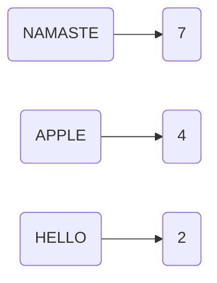
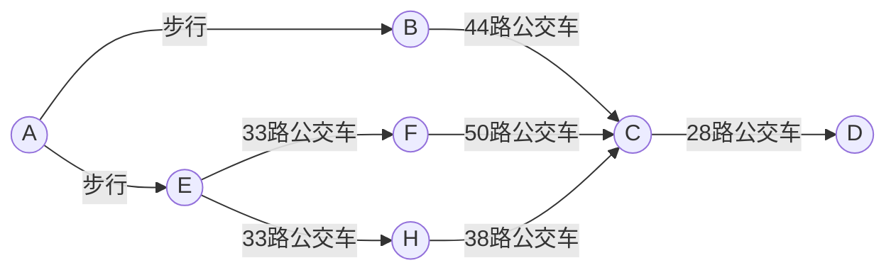
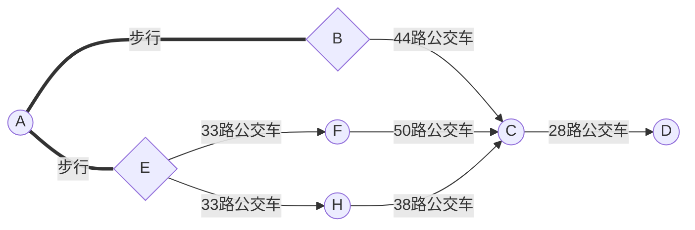
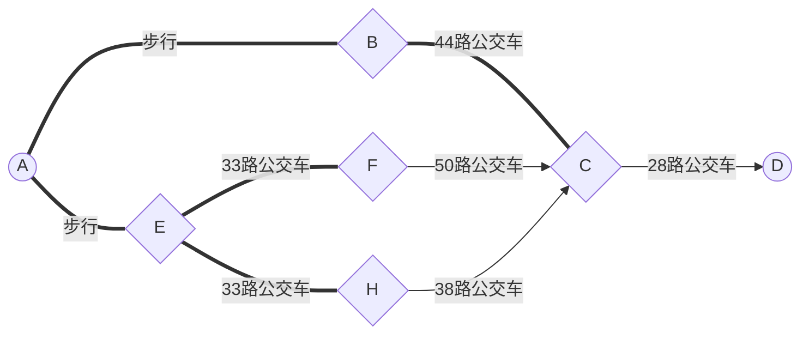
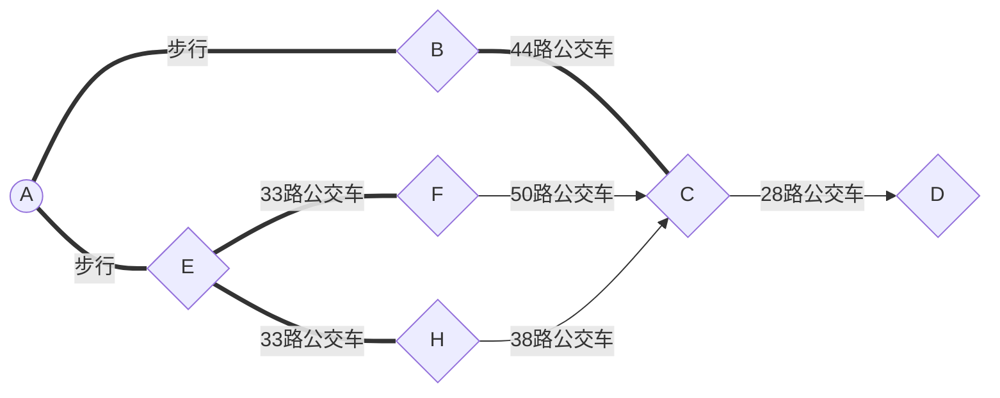
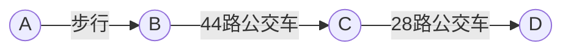

## 第Ⅰ部分 到底什么是算法？

**计算机没什么用，他们只会告诉你答案。——巴勃罗·毕加索**

&nbsp;&nbsp;&nbsp;&nbsp;&nbsp;&nbsp;&nbsp;&nbsp;计算机科学的本质之一就是算法研究。利用计算机解决实际问题，首先会选择一个合适的数学模型，来抽象出问题的本质特征，然后就是寻找一种算法，作为问题的解法。用什么方法来设计算法，如何判定一个算法的性能，设计的算法用云少运行时间和存储内存，这些问题是设计软件时所必须考虑的。算法性能的好坏也直接影响到软件性能的优劣。

跳转至：
[大O表示法](#Big_O_notation)
[常见的大O运行时间](#common_Big_O_notation)
[常见问题](#Q_A)

**什么是算法？**

通俗而言，算法就是一组完成任务的指令。

**算法有什么特征？**

1. 输入（Input）
2. 输出（Output）：一个算法必须有输出，不然没有什么意义来设计算法
3. 确定性（Definiteness）：每个步骤是明确定义的
4. 可行性（Effectiveness）
5. 有穷性（Finiteness）：执行有限步骤就终止

**算法有什么基本要素？**

- 对数据对象的运算和操作
  
  > 算术运算、逻辑运算、关系运算和数据传输

- 算法的控制结构
  
  > 顺序、选择和循环

算法可以用自然语言、流程图、N-S流程图和伪代码描述

**Data Structures + Algorithms  = Programs. ——Niklaus Wirth（1984年度图灵奖得主）**

**要怎样看待一个算法的好坏？**

&nbsp;&nbsp;&nbsp;&nbsp;&nbsp;&nbsp;&nbsp;&nbsp;这里提一下二分查找，其输入是有序的元素列表，如果要找的元素包含在列表中，二分查找返回其位置；否则返回null

> &nbsp;&nbsp;&nbsp;&nbsp;&nbsp;&nbsp;&nbsp;&nbsp;这里的示例说明了二分查找的工作原理。我随便想一个1~100的数字。
> 你的目标是以最少的次数找到我的数字。你每次猜测后，我会说小了、大了或对了。
> 
> &nbsp;&nbsp;&nbsp;&nbsp;&nbsp;&nbsp;&nbsp;&nbsp;假如你从1开始依次往上猜，猜测的过程会很长很长，这就是简单查找，更准确的说法是傻找。每次都只能排除一个数字。如果我想的是99，你得猜99次才能猜到！
> 
> &nbsp;&nbsp;&nbsp;&nbsp;&nbsp;&nbsp;&nbsp;&nbsp;下面就是一种更好的猜法。从50开始猜，小了，但排除了一半的数字，至此，你知道1~50都小了。接下来，你猜75，大了，那余下的数字又排除了一半！再接下来，你猜63（50和75中间的数字）...这就是二分查找。不管我心里想的是哪个数字，你在7次之内都可以猜到，因为每次猜测都能排除很多数字！
> 
> 一般来说，对于包含有n个元素的列表，用二分查找最多需要log<sub>2</sub><sup>n</sup>步，而简单查找却最多需要n步。

&nbsp;&nbsp;&nbsp;&nbsp;&nbsp;&nbsp;&nbsp;&nbsp;每次介绍算法时，我们都将讨论其运行时间。一般来说，应选择**效率**最高的算法，以最大限度地减少运行时间或占用空间。（有兴趣可看邓俊辉老师的[解释](https://www.bilibili.com/video/BV1hJ411S7wU?p=4&vd_source=4fe602163e123a42d52b1a7672e94c9a)）

&nbsp;&nbsp;&nbsp;&nbsp;&nbsp;&nbsp;&nbsp;&nbsp;回到之前的二分查找，使用它究竟可以节省多少时间呢？简单逐个地检查数字，如果列表有100个数字，最多需要猜100次。如果列表有40亿个数字，最多需要猜40亿次。换言之，最多需要猜测的次数与列表长度相同，这被称为**线性时间（linear time）**。

&nbsp;&nbsp;&nbsp;&nbsp;&nbsp;&nbsp;&nbsp;&nbsp;二分查找则不同，如果列表有100个数字，最多需要猜7次；如果列表有40亿个数字，最多需要猜32次。厉害吧？二分查找的运行时间为对数时间或（log时间）

<p id="Big_O_notation"></p>

&nbsp;&nbsp;&nbsp;&nbsp;&nbsp;&nbsp;&nbsp;&nbsp;运行时间是算法的尺子，那尺子上的刻度就是**大O表示法**，指出了算法究竟有多快。

> 上界（大 O 记号）、下界（Ω 记号）或者 准确界（ↀ 记号）三种表示方法
> 
> O(1)<O(log<sub>2</sub><sup>n</sup>)<O(n)<O(n*log<sub>2</sub><sup>n</sup>)<O(n<sup>2</sup>)<O(n<sup>3</sup>)
> O(2<sup>n</sup>)<O(n!)<O(n<sup>n</sup>)

**算法的运行时间以不同的速度增加**

&nbsp;&nbsp;&nbsp;&nbsp;&nbsp;&nbsp;&nbsp;&nbsp;Tom要为NASA编写一个查找算法，这个算法要在火箭即将登陆火星前开始执行，帮助计算着陆点。这个示例表明，两种算法的运行时间呈现不同的增速。Tom需要做出决定，是使用二分查找还是简单查找。使用的算法必须快速而准确。一方面，二分查找速度更快，Tom必须在10s之内找到着陆地点，否则火箭将偏离方向。另一方面，简答查找编写起来更容易，因此出现Bug的可能性更小。Tom不希望关键时刻掉链子！为了确保万无一失，他决定计算两种算法在列表有100个元素的情况下各自需要的时间。

&nbsp;&nbsp;&nbsp;&nbsp;&nbsp;&nbsp;&nbsp;&nbsp;假设检查一个元素需要1毫秒。使用简单查找时，Tom必须查找100个元素，也就是需要100ms才能查找完毕。而使用二分查找时，只需检查7个元素（log<sub>2</sub><sup>100</sup>大约为7），因此需要7ms就能查找完毕。然而，实际要查找的列表有10亿个元素，这种情况下，Tom测试了一下二分查找，运行时间为30ms。他心想，二分查找的速度大约为简单查找的15倍，因为列表包含100个元素时，简单查找需要100ms，二分查找需要7ms。因此，列表包含10亿个元素时，简单查找需要30*15=450ms，完全符合在10s内查找完毕的要求。Tom决定使用简单查找，这真的是个正确的选择吗？

&nbsp;&nbsp;&nbsp;&nbsp;&nbsp;&nbsp;&nbsp;&nbsp;不是。实际上，Tom错了，而且错得十分离谱。列表包含10亿个元素时，简单查找需要10亿ms，相当于11天！为什么呢？因为**二分查找和简单查找的运行时间的增速不同。**也就是说，随着元素数量的增加，二分查找需要的额外时间并不多，而简单查找需要的额外时间却很多。Tom以为二分查找是简单查找的15倍，这不对：列表包含10亿个元素时，为3300万倍。有鉴于此，仅知道算法需要多长时间才能运行完还不够，还需要知道运行时间如何随列表增长而增加。这就是大名鼎鼎的**渐进分析法**。大O表示法指出了算法有多快。简答查找是O(n)。单位秒呢？没有——大O表达法**让你比较操作数，它指出了算法运行时间的增速**。

**大O表示法指出了最糟糕情况下的运行时间**

&nbsp;&nbsp;&nbsp;&nbsp;&nbsp;&nbsp;&nbsp;&nbsp;假设你试图用简单查找在电话簿上的人。你知道，简单查找的运行时间为O(n)，这意味着最糟糕情况下，必须查找每个条目。如果查找的认识Alen——电话簿里的第一个人，一次就能找到，无需查看每个条目。考虑到一次就找到Alen，请问这种算法的运行时间是O(n)还是O(1)呢？

&nbsp;&nbsp;&nbsp;&nbsp;&nbsp;&nbsp;&nbsp;&nbsp;简单查找的运行时间总是O(n)。查找Alen时，一次就找到了，这是最佳情况，但大O表示法说的是最糟糕的情形。在最糟糕的情形下，必须查看电话簿的每个条目，对应的运行时间为O(n)。这是一个保证——你知道简单查找运行时间不可能超过O(n)。

<p id="common_Big_O_notation"></p>

> 一些常见的大O运行时间
> 
> 下面从快到慢列出经常遇到的5种大O运行时间
> 
> - O(log<sub>2</sub><sup>n</sup>)，也叫对数时间，包括二分查找
> - O(n)，也叫线性时间，包括简单查找
> - O(n*log<sub>2</sub><sup>n</sup>)，包括较快的快速排序
> - O(n<sup>2</sup>)，包括较慢的选择排序
> - O(n!)，包括旅行商问题——一种非常慢的算法

这里做一个小小的总结。

- 算法的速度并非时间，而是操作数的增速
- 谈论算法的速度时，我们说的时随着输入的增加，其运行时间将以什么样的速度增加
- 算法的运行时间用大O表示法表示
- O(log<sup>n</sup>)比O(n)快，当搜索的元素越多时，前者比后者快得越多
- 一般O(log<sup>n</sup>)是指以2为底的O(log<sub>2</sub><sup>n</sup>)

<p id="Q_A"></p>

**常见问题**

&nbsp;&nbsp;&nbsp;&nbsp;&nbsp;&nbsp;&nbsp;&nbsp;问题是越来越多，算法也是越来越多，但它们都是由一些求解基本问题的基本算法组合而成，下面是一些基本问题

1. 排序问题：插入排序、选择排序、归并排序、桶排序...
2. 查找问题：顺序查找、二分法查找、哈希查找...
3. 图问题：深度优先算法、广度优先算法、最短路径算法...
4. 组合问题：计算领域最难的问题，旅行商问题是典型
5. 几何问题：凸包问题和最近点对问题是典型
6. 数值问题：求解方程组、定积分、函数最大值...
7. 其他常见问题：最大子段和问题、找钱问题、背包问题、多段最短路径问题、n皇后问题、假币问题、（字符）串处理问题

**算法设计**

&nbsp;&nbsp;&nbsp;&nbsp;&nbsp;&nbsp;&nbsp;&nbsp;首先明确一点，并不是所有的问题都有算法。有的问题研究可行，就有对应的算法；有些问题不能说明可行，就没有对应的算法，但不是说这类问题没有结果。

> 例如，猜想问题，有结果，然而截至目前还没有算法

算法分为**数值计算算法**和**非数值计算算法**

> 数值计算算法
> 
> 顾名思义，主要用于科学计算，像什么解方程的根、求积分和建立数学模型等
> 
> 1. 迭代法，求解方程近似根
> 2. 插值法
> 3. 差分法，求解微分方程的近似解
> 4. 归纳法
> 5. 递推法
> 6. 减半递推技术
> 7. 递归法
> 
> 非数值计算算法
> 
> 1. 穷举法
> 2. 分治算法，问题不断化为更小的问题
> 3. 贪心算法，最优解
> 4. 动态规划算法，用填表的方法保存计算的中间结果
> 5. 回溯算法，跳过大量无需测试的数据，快速得解
> 6. 分支限界算法

# 第Ⅱ部分 了解算法...

**旅行商**

&nbsp;&nbsp;&nbsp;&nbsp;&nbsp;&nbsp;&nbsp;&nbsp;阅读到这，你可能认为不可能存在运行时间按为O(n!)的算法。让我来证明你错了！这是一个计算机科学领域非常著名的旅行商问题，其计算时间增加得非常快，而那些非常聪明的人都认为它没有改进空间。

&nbsp;&nbsp;&nbsp;&nbsp;&nbsp;&nbsp;&nbsp;&nbsp;有一位旅行商。他需要前往5个城市。这位旅行商（姑且称之为Opus吧）要前往5个城市，同时要确保旅程最短，为此，可考虑前往城市的各种可能顺序。对于每种顺序，他都计算总旅程，再挑选出旅程最短的路线。5个城市有120次操作。涉及6个城市时，需要720次操作（有720种排列方式）。涉及7个城市时，需要5040次操作！推广一下，涉及n个城市时，需要执行n！（n的阶乘）次操作才能计算出结果。因此运行时间为O(n!)，即阶乘时间。除非涉及的城市很少，否则需要执行非常多的操作。如果涉及的城市数超过100，根本不能在合理的时间内计算出来——等你计算出结果来，太阳都没了。

&nbsp;&nbsp;&nbsp;&nbsp;&nbsp;&nbsp;&nbsp;&nbsp;这种算法很糟糕！Oups应使用别的算法，可他别无选择。这是计算科学领域亟待解决的问题之一。对于这个问题，目前还没有找到更快的算法，我们只能去找近似答案。

**内存的工作原理**

&nbsp;&nbsp;&nbsp;&nbsp;&nbsp;&nbsp;&nbsp;&nbsp;假如你要去看演出，需要将东西寄存。寄存处有一个柜子，柜子有很多抽屉。每个抽屉可以放一样东西，你有两样东西需要寄存，因此要了两个抽屉。你将两样东西存放在抽屉里。现在你就可以去看演出了！这大致就是计算机内存的工作原理。

&nbsp;&nbsp;&nbsp;&nbsp;&nbsp;&nbsp;&nbsp;&nbsp;计算机就像是很多抽屉的集合体，每个抽屉都有地址。需要将数据存储到内存时，你请求计算机提供存储空间，计算机给你一个存储地址。需要存储多项数据时，有两种基本方式——数组和链表。它们差别很大。

## 数组和链表

跳转至：
[链表](#The_list)
[数组](#The_array)
[插入](#insert)
[删除](#delete)

&nbsp;&nbsp;&nbsp;&nbsp;&nbsp;&nbsp;&nbsp;&nbsp;有时候，你需要在内存中存储一系列元素。假如你要编写一个管理代办事项的应用程序，为此需要将这些代事项存储到内存中。应使用数组还是链表呢？鉴于数组更容易掌握，我们先将待办事项存储到数组中。使用数组就意味着所有的待办事项在内存中都是相连的（紧靠在一起的）。

&nbsp;&nbsp;&nbsp;&nbsp;&nbsp;&nbsp;&nbsp;&nbsp;现在假设你要添加第4个待办事项，但是后面的那个抽屉放着别人的东西！这就像你与朋友去看电影，找到地方就坐后又来了一位朋友，但原来坐的地方没有空的位置，只能再找一个可坐的座位。在这种情况下，你要求计算机重新分配一块可以容纳4个代办事项的内存，再将所有的待办事项移到那里。

&nbsp;&nbsp;&nbsp;&nbsp;&nbsp;&nbsp;&nbsp;&nbsp;如果又来了一位朋友，而当前的地方也没有空位，你们就得再次转移！真的麻烦！同样，在数组中添加新元素也可能很麻烦。如果没有了空间，就得一刀内存的其他地方，因此添加新元素得速度会很慢。一种办法就是''预留座位"：也就是说当前只有3个待办事项，但是我请求计算机给10个待办事项的位置，以防需要添加待办事项，只要它不超过10个，就无需转移。这似乎是一个不错的措施，但你应该明白，它存在以下两个缺点：

- 你额外请求的位置可能根本用不到，这将浪费内存。你不用，别人也用不了。
- 待办事项超过10个后，你还得转移。

面对这种问题，可使用**链表**来解决

<p id="The_list"></p>

**链表**

- 链表中的每个元素可存储在内存的**任何地方**。
- 链表中的每个元素都存储了**下一个元素的地址**，从而使一系列随机的内存地址串在一起。

&nbsp;&nbsp;&nbsp;&nbsp;&nbsp;&nbsp;&nbsp;&nbsp;这就如同寻宝游戏。你前往第一个地址，那里有一张纸条写着"下一个元素的地址是123"。因此，你前往地址123，那里又有一张纸条，写着"下一个元素的地址是847"，以此类推。在链表中添加元素很容易：只需将其放入内存，并将其地址存到前一个元素中。

&nbsp;&nbsp;&nbsp;&nbsp;&nbsp;&nbsp;&nbsp;&nbsp;使用链表时，根本不需要移动元素。这还可避免另一个问题。假如你与五位朋友去看一部很火的电影。你们六个人想坐在一起，但看电影的人多，没有六个一起的座位。数组只能说"电影看不了"；而链表却说"我们六个分开坐"，因此，只要有足够的内存空间，就有能力为链表分配内存。链表的优势在于插入元素方面，那数组的优势又是什么呢？

<p id="The_array"></p>

**数组**

&nbsp;&nbsp;&nbsp;&nbsp;&nbsp;&nbsp;&nbsp;&nbsp;排行榜网站总是使用卑鄙的手段来增加页面浏览量。它们不在一个页面展示整个排行榜，而将排行榜的每项内容放在一个页面，并让你点击"next"来查看下一项内容。你必须点击9次，才能看到第一大反派是谁，这让网站可以在10个页面给中显示广告，这样真的很烦。如果整个排行榜都显示在一个页面中，浙江方便得多。这样，用户可单击人名来获得更详细得信息。

&nbsp;&nbsp;&nbsp;&nbsp;&nbsp;&nbsp;&nbsp;&nbsp;链表存在类似得问题。在需要读取最后一个元素时，你不能直接读取，因为你不知道它所处得地址，必须先访问元素#1，从中获取#2的地址，再访问#2并从中获取#3的地址，以此类推，知道访问到最后一个元素。需要同时读取所有元素，链表的效率很高：你读取第一个元素，根据其中的地址再去读取下一个元素，以此类推；但如果你需要跳跃，链表的效率真的很低。

&nbsp;&nbsp;&nbsp;&nbsp;&nbsp;&nbsp;&nbsp;&nbsp;数组与此不同你知道其中每个元素的地址。假如有一个数组，它包含五个元素，起始地址#1为00，那么元素#5的地址是多少呢？执行简单的数学运算得到：04.需要随机读取元素时，数组的效率很高，因为可迅速找到数组的任何元素。在链表中，元素并非靠在一起的，你无法迅速计算出第五个元素的内存地址，只能从头开始查找，直到访问到第四个元素。

> 数组的元素编号从0开始而不是1
> 
> 元素的位置称为索引

|     | 数组   | 链表   |
| --- | ---- | ---- |
| 读取  | O(1) | O(n) |
| 插入  | O(n) | O(1) |

> O(n) = 线性时间
> O(1) = 常量时间

<p id="insert"></p>

**在中间插入**

&nbsp;&nbsp;&nbsp;&nbsp;&nbsp;&nbsp;&nbsp;&nbsp;假如你要让待办事项按日期排列。之前，你在清单末尾添加待办事项。但现在你要根据新增待办事项的日期将其插入到正确的位置。需要往中间插入元素时，数组和链表究竟哪个会更好？使用链表时，插入元素很简单，只需修改它前面的那个元素指向的地址。而使用数组时，则必须将后面的元素都向后移。如果没有足够的空间，还得将整个数组赋值到其他地方！因此，当需要插入中间元素时，链表显然是最好的选择。

<p id="delete"></p>

**删除**

&nbsp;&nbsp;&nbsp;&nbsp;&nbsp;&nbsp;&nbsp;&nbsp;如果你要删除元素呢？链表也是更好的选择，因为只需修改前一个元素指向的地址即可。而使用数组时，删除元素后，必须将后面的元素都前移。不同于插入，删除元素总能成功。如果内存中没有足够的空间，插入操作可能会失败，但在任何情况下都能将元素删除。

|     | 数组   | 链表   |
| --- | ---- | ---- |
| 读取  | O(1) | O(n) |
| 插入  | O(n) | O(1) |
| 删除  | O(n) | O(1) |

> 需要指出的是，仅当能够立即访问要删除的元素时，删除操作的运行时间才为O(1)。通常我们记录了链表的第一个元素和最后一个元素，因此此删除这些元素时运行时间为O(1)

总结一句：链表擅长插入和删除，数组更擅长随机访问

## 选择排序

&nbsp;&nbsp;&nbsp;&nbsp;&nbsp;&nbsp;&nbsp;&nbsp;假如你的计算机里有很多乐曲,对于每个乐队，你都记录了其作品被播放的次数。你要将这个列表播放次数从多到少的顺序排列，从而将你最喜欢的乐队排序。该如何操作呢？

&nbsp;&nbsp;&nbsp;&nbsp;&nbsp;&nbsp;&nbsp;&nbsp;一种办法是遍历这个列表，找出作品播放次数最多的乐队，并将该乐队添加到一个新列表中。再次这样做，找出播放次数第二多的乐队。一直做下去，你将得到一个有序列表。下面从计算机的角度出发，看看这需要多长时间。不要忘记，O(n)意味着查看列表中的每个元素一次。例如，对乐队列表进行简单查找时，意味着每个乐队都要查看一次。因此这种时间为O(n)的操作，你需要执行n次。需要的总时间为O(n*n)=O(n<sup>2</sup>)。

**需要检查的元素数越来越少**

&nbsp;&nbsp;&nbsp;&nbsp;&nbsp;&nbsp;&nbsp;&nbsp;随着排序的进行，每次需要检查的元素数在逐渐减少，最后一次只需要检查一个元素。既然如此，运行时间怎么还是O(n<sup>2</sup>)呢？这个问题问得好，这与大O表示法的常数有关。

&nbsp;&nbsp;&nbsp;&nbsp;&nbsp;&nbsp;&nbsp;&nbsp;你说得没错，并非每次都需要检查n个元素。第一次需要检查n个元素，但随后检查的元素依次为n-1,n-2,...,2和1.平均每次检查的元素数为1/2×n，因此运行时间为O(n×1/2×n)，但大O表示法关注的是趋势，直接省略诸如1/2这样的常熟，因此简单地写作O(n<sup>2</sup>)。

选择排序是一种灵巧的算法，但速度不是很快。快速排序是一种更快的排序算法，其运行时间为O(nlog<sup>n</sup>)，之后会介绍。

**示例代码**

将数组元素从小到大的顺序排列。

先编写一个用于找出数组中最小元素的函数。

```python
def findSamllest(arr):
    smallest = arr[0];#存储最小值
    smallest_index = 0;#存储最小元素的索引
    for i in range(1,len(arr)):
        if arr[i] < smallest:
        smallest = arr[i]
        smallest_index = i
    return smallest_index
```

现在用这个函数编写选择排序算法

```python
def selectionSort(arr):
    newArr = []
    for i in range (len(arr)):
        smallest = findSmallest(arr)#找出最小的元素，并添加到新数组
        newArr.append(arr.pop(samllest))
    return newArr
print selectionSort([5,3,6,2,10])
```

## 递归算法

跳转至：
[基线条件和递归条件](#Baseline_conditions_and_recursive_conditions)
[特性](#Three_characteristics)

>  递归算法是一种通过自身调用自身或间接调用自身来达到问题解决的算法。

&nbsp;&nbsp;&nbsp;&nbsp;&nbsp;&nbsp;&nbsp;&nbsp;假设你在祖母的阁楼中翻箱倒柜，发现了一个上锁的神秘手提箱。祖母告诉你，钥匙很可能在下面这个盒子里。这个盒子里有盒子，而盒子里又有盒子。钥匙就在某个盒子中。为了找到钥匙，你将使用什么算法？

- 下面是一种方法。
  
  > 1. 创建一个盒子堆
  > 2. 从盒子堆中取出一个盒子，在里面找
  > 3. 如果找到的是盒子，就将其加入盒子堆中，以便以后查找
  > 4. 如果找到钥匙，就大功告成
  > 5. 回到第二步

- 下面是另一种方法。
  
  > 1. 检查盒子里的每样东西
  > 2. 如果是盒子，就回到第一步
  > 3. 如果是钥匙，就大功告成

哪种方法更容易呢？第一种方法使用的是while循环：只要盒子堆不空，就从中取一个盒子，并在里面仔细查找。

```python
def look_for_key(main_box):
    pile = main_box.make_a_pile_to_look_though()#pile：堆
    while pile is not empty:
        box = pile.grab_a_box()#grab：抓取
        for item in box:
            if item.is_a_box():
                pile.append(item)
            elif item.is_a_key():
                print "found the key!"
```

第二种方法使用递归——自己调用自己。

```python
def look_for_key(box):
    for item in box:
        if item.is_a_box():
            look_for_key(item)#递归
        elif item.is_a_key():
            print "found the key!"
```

这两种方法的作用相同。

> "如果使用循环，程序的性能可能更高；如果使用递归，程序可能更容易理解。如何选择要看什么对你来说更重要。"                ——Leigh Caldwell

递归的**基本思想**是把一个要求解的问题划分成多个规模更小的子问题，这些子问题应该与原问题保持同一类型，然后用同样的方法求解规模更小的子问题。

<p id="Baseline_conditions_and_recursive_conditions"></p>

**基线条件和递归条件**

&nbsp;&nbsp;&nbsp;&nbsp;&nbsp;&nbsp;&nbsp;&nbsp;由于递归函数调用自己，因此编写这样的函数时很容易出错，进而导致无限循环。假如你要编写一个倒计时的函数：`>3...2...1`

为此，你可以用递归的方式编写，如下：

```python
def countdown(i):
    print i 
    countdown(i-1)
```

如果你运行上述代码就发现：这个函数运行起来没完没了！

> 3...2...1...0...-1...-2...

(要让脚本停止运行，可按<kbd>Ctrl</kbd>+<kbd>C</kbd>)

编写递归函数时，必须告诉它何时停止递归。正因为如此，每个递归函数都有两部分：**基线条件(base case)**和**递归条件(recursive case)**。<u>递归条件是函数调用自己，而基线条件是函数不再调用自己，从而避免无限循环。</u>

来给函数countdown添加基线条件。

```python
def countdown(i):
    print i
   if i <= i:#极限条件
    return 
   else:#递归条件
    countdown(i-1)
```

现在函数就可以想预期的那样运行！

<p id="Three_characteristics"></p>

简单总结，递归具有以下**三个特性**：

1. 问题能被划分成一个或多个结构相同、规模更小的问题。相邻两次重复之间有联系，通常较小问题的输出是较大问题的输入
2. 递归调用的次数有限
3. 有结束递归的条件。当达到限制条件是，能直接得解

求阶乘问题。

> 要求解 `n!` 
> 
> 首先要转化问题`n! = n * (n-1)!`，求解`(n-1)!`
> 
> 然后划分小问题 `(n-1)! = (n-1) * (n-2)!`,求解`(n-2)!`
> 
> 有规律的递减，直到`1!`结束
> 
> 当得到`n=1`的解之后，再返回来，不断处理
> 
> 直到得到规模为`n`的问题的解为止
> 
> 递归在实现时，自身调用自身，层层向下进行，而求解原问题的解时次序正好相反
> 
> 

## 栈

调用栈(call stack)是个很重要的概念！

&nbsp;&nbsp;&nbsp;&nbsp;&nbsp;&nbsp;&nbsp;&nbsp;假如你要取野外烧烤，并为此创建了一个待办事项清单——叠便条。之前的那个待办事项清单可以添加清单的任何地方和删除任何一个事项。而叠便条要简单得多：插入的待办事项放在清单的最前面；读取待办事项时，你只读取最上面的那个，并将其删除。

因此这个代办事项清单只有两种操作：**压入**(插入)和**弹出**(删除并读取)。

这种数据结构称为**栈**。栈是一种简单的数据结构。

**调用栈**

**计算机在内部使用的栈被称为调用栈**。我们来看看计算机是如何调用栈的。下面是一个简单的函数。

```python
def greet(name):
    print "hello," + name + "!"
    greet2(name)
    print"getting ready to say bye..."
    bye()
```

这个函数问候用户，再调用另外两个函数。这两个函数的代码如下。

```python
def greet2(name):
    print"how are you," + name + "?"
def bye():
    print"ok bye!"
```

下面详细介绍调用函数时发生的情况。

> 说明：在`python`中，`print`是一个函数，但是处于简化考虑，这里假设它不是，你也这样假设就行了。

假设调用`greet("magggie")`，计算机将首先为该函数调用分配一块内存。我们来使用这些内存。变量`name`被设置为`maggie`，这需要存储到内存中。

每当你调用函数时，计算机都像这样将函数调用涉及的所有变量的值存储到内存中。接下来，你打印`hello,maggie!`再调用`greet2("maggie")`。同样，计算机也为这个函数调用分配了一块内存。

计算机使用一个栈来表示这些内存块，其中第二个内存块位于第一个内存块上面。你打印`how are you,maggie?`，然后从函数调用返回。此时，栈顶的内存块被弹出。

&nbsp;&nbsp;&nbsp;&nbsp;&nbsp;&nbsp;&nbsp;&nbsp;现在，栈顶的内存块是函数`greet`的，这意味着你返回到了函数`greet`。当你调用函数`greet2`时，函数`greet`只执行了一部分。这是一个重要的概念：**调用一个函数时，当前函数暂停并处于未完成状态。该函数的所有变量的值都还在内存中。**执行完`greet2`后，你回到函数`greet`，并从离开的地方开始接着往下执行：首先打印`greeting ready to say bye...`，再调用函数`bye`。

&nbsp;&nbsp;&nbsp;&nbsp;&nbsp;&nbsp;&nbsp;&nbsp;在栈顶添加了函数`bye`的内存块。然后，你打印`ok bye!`，并从这个函数返回。现在你又回到了函数`greet`。由于没有别的事情要做了，就从这个函数`greet`返回。**这个栈用于存储多个函数的变量，被称为调用栈。**

**递归调用栈**

&nbsp;&nbsp;&nbsp;&nbsp;&nbsp;&nbsp;&nbsp;&nbsp;递归函数也使用调用栈！看看递归函数`factorial`的调用栈。`factoriacal(5)`写作$5!$,其定义如下：$5!=5*4*3*2*1$。同理，`factorical(3)`为$3!=3*2*1$。阶乘的递归函数：

```python
def fact(x):
    if x == 1:
        return 1
    else:
        return x*fact(x-1)
```

下面来详细分析调用`fact(3)`时调用栈如何变化的。栈顶的方框指出了当前执行到了什么地方。


> 注意：每个`fact`调用函数都有自己的`x`变量。在一个函数调用中不能访问另一个`x`变量

&nbsp;&nbsp;&nbsp;&nbsp;&nbsp;&nbsp;&nbsp;&nbsp;使用栈虽然很方便，但是也要付出代价：存储详尽的信息可能占用大量的内存。每个函数调用要占用一定内存，如果栈很高，就意味着计算机存储了大量函数调用的信息。在这种情况下，你有两种选择。

- 重新编写代码，转而使用循环。
- 使用尾递归。这是一个高级递归，另外，并非所有的语言都支持尾递归

## 分而治之

&nbsp;&nbsp;&nbsp;&nbsp;&nbsp;&nbsp;&nbsp;&nbsp;学习分而治之，有时候，你可能遇到使用任何已知的算法都无法解决的问题。优秀的算法学家不会放弃，而是尝试使用掌握的各种问题解决方法来找出解决方案。分而治之就是学习的第一种通用的问题解决方案。

学习快速排序——一种优雅的排序算法。快速排序是使用分而治之的策略

分而治之(diviide and conquer,D&C)——一种著名的递归式问题解决方法

D&C并不那么容易被掌握，我们通过三个示例来介绍。首先是一个直观的示例；然后，介绍一个代码示例；最后详细介绍快速排序——一种使用D&C的排序算法

&nbsp;&nbsp;&nbsp;&nbsp;&nbsp;&nbsp;&nbsp;&nbsp;假如你是农场主，有一小块土地。你要将这块地均匀地分成方块，且分出的方块要尽可能大。如何将一块地均匀地分成方块，并确保分出的方块是最大的呢？使用D&C策略！D&C算法是递归的。使用D&C解决问题的过程包括两各步骤。

1. 找出基线条件，这种条件尽可能简单
2. 不断将问题分解（或者说缩小问题规模），直到找到基线条件

&nbsp;&nbsp;&nbsp;&nbsp;&nbsp;&nbsp;&nbsp;&nbsp;下面来处理前述问题。首先，找出基线条件。最容易处理的情况是，一条边的长度是另一条边的整数倍。如果一边长50m，另一边长25m，那么可使用的最大方块为$25 * 25$。换言之可以将这块地分成两个这样的方块。

&nbsp;&nbsp;&nbsp;&nbsp;&nbsp;&nbsp;&nbsp;&nbsp;现在要找出递归条件，这是D&C的用武之地。根据D&C的定义，每次递归调用都必须缩小问题的规模。如何缩小问题的规模呢？我们首先找出这块地可容纳的最大方块，你可以从这块地中划分出两个$640m * 640m$的方块，同时余下一小块地。现在是顿悟时刻：何不对余下的地使用同样的算法呢？

&nbsp;&nbsp;&nbsp;&nbsp;&nbsp;&nbsp;&nbsp;&nbsp;最初要划分的土地是$1680m * 640m$，而现在划分的土地更小，为$640m * 400m$。适用于这小块地的最大方块，也同样使用于整块地的最大方块。换言之，你将均匀划分$1640m * 640m$土地的问题，简化成了均匀划分$640m * 400m$土地的问题！

&nbsp;&nbsp;&nbsp;&nbsp;&nbsp;&nbsp;&nbsp;&nbsp;下面再次使用同样的算法，对于$640m * 400m$的土地，可从中划分出的最大方块为$400m * 400m$，这样余下一块更小的土地，其尺寸为$400m * 240m$。再划分为$240m * 160m$。再划分就是$160m * 80m$，余下的土地满足基线条件，因为160是80的整数倍。而且，将这块土地分成两个方块后，将不会余下任何土地！

因此，对于最初的那片土地，适用的最大方块为$80m * 80m$。

这里再次重申一下D&C的**工作原理**：

1. 找出简单的基线条件
2. 确定如何缩小问题的规模，使其符合基线条件

> D&C并非可用于解决问题的算法，而是解决问题的一种思路

接下来，再看一个示例。给定一个数字数组，你需要将这些数字相加，并返回结果。使用循环很容易完成这项任务。

```python
def sum(arr):
    total = 0
    for x in arr:
        total += x
    return total
print sum([1,2,3,4])
```

但是如何用递归函数来完成这种任务呢？

- 第一步：找出基线条件。最简单的数组什么样？如果数组不包含任何元素或者只有一个元素，计算总和非常容易。因此，这就是基线条件。

- 第二步：每次递归调用都必须里空数组更近一步。如何缩小问题的规模呢？下面是一种办法：`sum([2,4,6])=12`与下面这个版本等效，`2+sum([4,6])=2+10=12`。这两个版本的结果都是12，但在第二个版本中，给函数`sum`传递的数组更短。换言之，这缩小了问题规模！

```
//函数的运行过程如下：
sum([2,4,6])
2+sum([4,6])//与第2行等效
4+sum([6])//缩小问题规模
sum([6])//这就是基线条件
//以上是压入栈，以后就是弹出栈
6
4+6=10
2+10=12
12就是最终结果
```

## 快速排序

跳转至：
[工作原理](#How_quicksort_works)
[再谈大O表示法 ](#Now_big_O_notation)
[比较合并排序和快速排序 ](#Compare_two_sorts)
[平均情况和最糟情况 ](#Average_case_and_worst_case)
[快速排序小结](#Quick_sort_summary)

快速排序使用了D&C，使用常用的排序。

> 对于排序算法来说，最简单的数组什么样？就是根本不需要排序的数组。像空数组和只含有一个元素的数组。

```python
def quicksort(array):
    if len(array)<2:
    return array
```

因此，基线条件为数组为**空**或**只包含一个元素**。这种情况下，只需原样返回数组——根本不需要排序。

- 我们来看看更长的数组。对于**包含两个元素的数组**，排序也很容易：检查第一个元素是否比第二个小，如果不比第二个小，就交换它们的位置。
- 包含**三个元素的数组**`[33,15,10]`呢？记住要使用D&C，因此需要将数组分解，直到满足基线条件。

<p id="How_quicksort_works"></p>

下面介绍快速排序的**工作原理**。

> 首先，从数组中选择一个元素，这个元素称为<u>基准值</u>（pivot）我们暂且将数组的第一个元素作为基准值。
> 
> 接下来，找出比基准值小的元素以及比基准值大的元素。
> 
> ```
> [15,10]（小于33的元素）   33（基准值）  []（大于33的元素空数组）
> ```
> 
> 这被称为分区(partitioning)，现在你有：
> 
> - 一个由所有小于基准值的数字组成的子数组
> - 基准值
> - 一个由所有大于基准值的数字组成的子数组
> 
> 这里只是分区，得到的两个子数组还是无序的。但是如果这两个数组是有序的，对整个数组进行排序将是非常容易的。
> 
> 假如子数组是有序的，就可以像下面这样合并并得到一个有序的数组：左边的数组+基准值+右边的数组。这里就是`[10,15]+33+[ ]`，结果就是`[10,15,33]`
> 
> 如何对子数组进行排序？缩小问题规模。。。再次对这两个子数组进行快速排序，再合并结果。不管对哪个元素用作基准值，这都管用。假如15是基准值——`[10] 15 [33]`，这个子数组都只有一个，不用排序。

现在你知道如何对包含**三个元素的数组**进行排序，步骤如下：

1. 选择基准值。

2. 将数组分为两个子数组：小于基准值的元素和大于基准值得元素。

3. 对这两个子数组进行快速排序
- 包含**四个元素的数组**呢？`[33,10,15,7]`

> 假设你也将33用作基准值。`[10 15 7]  33 []`
> 
> 左边的子数组包含三个元素，而你已经知道对包含三个元素的数组进行排序：对其递归地调用快速排序。`[7] 10 [15] 33 []`

因此你能够对包含四个元素的数组进行排序，五个、六个......

> 归纳证明：
> 
> 刚才见识了归纳证明！它分两步：基线条件和归纳条件。
> 
> 假如我们要证明我们能爬到梯子的最上面。递归条件是这样的：如果我站在一个阶梯上，就能将脚放在下一个阶梯上。换言之，如果我们站在第二个阶梯上，就能站到第三个阶梯上。这就是归纳条件。而基线条件是我已经站在第一个阶梯上。因此，通过每次爬一个阶梯，我们就能爬到梯子最顶端。

下面是快速排序的代码

```python
def quicksort(array):
    if len(array) < 2    #基线条件：为空或只包含一个元素的数组是"有序"的
        return array
    else:
        pivot = array[0]    #递归条件
        less = [i for i in array[1:] if i <= pivot]#由所有小于等于基准值的元组组成的子数组
        greater = [i for i array[1:] if i > pivot]#由所有大于基准值的元组组成的子数组
        return quicksort(less) + [pivot] + quicksort(greater)
print quicksort([10,5,2,3])
```

<p id="Now_big_O_notation"></p>

**再谈大O表示法**

快速排序的独特之处在于，其速度取决于选择的基准值。

&nbsp;&nbsp;&nbsp;&nbsp;&nbsp;&nbsp;&nbsp;&nbsp;选择排序的运行时间为O(n<sup>2</sup>)，速度非常慢。还有一种合并排序的排序算法，其运行时间为O(nlog<sup>n</sup>)，比选择排序快多了！快速排序比较棘手，再最糟糕的情况下，其运行时间为O(n<sup>2</sup>)。

与选择排序一样慢！但这是最糟的情况。在平均情况下，快速排序的运行时间为O(nlog<sup>n</sup>)，可能你有一下疑问：

- 这里说的最糟情况和平均情况是？
- 若快速排序在平均情况下的运行时间是O(nlog<sup>n</sup>)，而合并排序的运行时间总是O(nlog<sup>n</sup>)，为何不用合并排序？它不是更快吗？

<p id="Compare_two_sorts"></p>

**比较合并排序和快速排序**

假如有下面这样打印列表中每个元素的简单函数

```python
def print_items(list):
    for item in list:
        print item
```

> 这个函数遍历列表中的每个元素并将其打印出来。它迭代整个列表一次，因此运行时间为O(n)。现在假设要对这个函数进行修改，使其在打印每个因素前都要休眠`1`秒钟。

```python
from time import sleep
def print_items2(list):
    for item in list:
        sleep(1)
        print item
```

> 它在每打印一个元素之前，都会暂停`1`秒钟。这两个函数都迭代了整个列表，而大O表示法忽略常熟的影响力，因此它们的运行时间都为O(n)。
> 
> 那你认为哪个函数的速度更快？我觉得是`print_items`（也就是第一个）要快得多，毕竟它没有暂停。因此，虽然使用大O表示法时，这两个函数得速度相同，但实际上`print_items`的速度更快。
> 
> 在大O表示法中，`n`实际上是这样的。
> 
> $C * n$ 
> 
> `C`是算法所需的固定时间量，被称为常量。例如`print_items`所需的时间可能是$10毫秒 * n$，而`print_items2`所需的时间为$1秒 * n$。通常不考虑这个常量，因为如果两种算法的大O运行时间不同，这种常量将无关紧要。
> 
> > 举个例子说明更直观一点：二分查找和简单查找。假如运行时间分别是：$10毫秒 * n$（简单查找）VS $1秒 * logn$(二分查找)，你可能认为简单查找要快得多，因为$10毫秒$显然比$1秒$耗时更少。但现在假设要在40亿个元素的列表中查找，所需时间如下：$10毫秒 * 40亿 = 463天$（简单查找） $1秒 * 32 = 32秒$（二分查找）。正如所看到的，二分查找要快得不是半点，常量根本没有什么影响。
> 
> &nbsp;&nbsp;&nbsp;&nbsp;&nbsp;&nbsp;&nbsp;&nbsp;但有的时候，常量的影响可能很大。对快速查找和合并查找就是如此。快速查找的常量比合并查找小，因此如果它们的运行时间都为O(nlog<sup>n</sup>)，快速查找的速度更快。实际上，快速查找的速度确实更快，因为相对于遇上最糟情况，它遇上平均情况的可能性要大得多。

<p id="Average_case_and_worst_case"></p>

**平均情况和最糟情况**

>  &nbsp;&nbsp;&nbsp;&nbsp;&nbsp;&nbsp;&nbsp;&nbsp;快速排序的性能高度依赖于你选择的基准值。假如你总是将**第一个元素用作基准值**，且要处理的数据是有序的。由于快速排序算法不检查输入数组是否有序，因此它依然尝试对其进行排序。

```
[1 2 3 4 5 6 7 8]
[] 1 [2 3 4 5 6 7 8]//每次都将第一个作为基准值
[] 2 [3 4 5 6 7 8]
...
[] 7 [8]
```

> 注意，数组并没有被分成两半，相反，其中一个子数组始终为空，这导致调用栈非常长。现在假设你总是将**中间的元素作用基准值**

```
[1 2 3 4 5 6 7 8]
[1 2 3] 4 [5 6 7 8]
[1] 2 [3]  &  [5] 6 [7 8]
[] 7 [8]
```

> 调用栈短得多！因为每次都将数组分成两半，所以不需要那么多得递归调用，很快就可以达到基线条件，因此调用栈短得多。

第一个示例是最糟情况，栈长为O(n)，第二个则是最佳情况，栈长为O(log<sup>n</sup>)。

> 1. 第一个示例：现在看栈的第一层。你将一个元素用作基准值，并将其他元素划分到两个数组中。此操作涉及了全部的8个元素，时间为O(n)。
> 
> 在调用栈的第一层，涉及全部8个元素，但实际上，在调用栈的每层都涉及O(n)个元素，因此完成每层所需的时间都为 O(n)，最糟情况下整个算法需要的时间为$O(n) * O(n) = O(n^2)$
> 
> 2. 第二个示例：层数为O(log<sup>n</sup>)（专业一点说，调用栈的高度为O(log<sup>n</sup>)，而每层需要的时间为O(n)，因此最佳情况下整个算法需要的时间为$O(n) * O(log^n) = O(nlog^n)$。
> 
> 这里说明一点，**最佳情况也是平均情况**，只要你每次都随机地选择一个数组元素作为基准值，快速排序的平均运行时间就将为O(n log <sup>n</sup>)。

<p id="Quick_sort_summary"></p>

浅浅地**小结**一下：

> - D&C将问题逐步分解。使用D&C处理列表时，基线条件很可能是空数组或只包含一个元素的数组。
> - 实现快速排序时，请随机地选择元素用作基准值，快速排序的平均运行时间为O(n log <sup>n</sup>)。
> - 大O表示法中的常量有时候事关重大，这就是快速排序比合并排序快的原因。
> - 比较简单查找和二分查找时，常量几乎无关紧要，因为数据很多时，O(log<sup>n</sup>)的速度比O(n)快得多。

## 散列表

跳转至：
[散列函数](#hash_function)
[散列表的应用案例](#Hash_table_application_case)
[冲突](#Hash_table_conflict)
[性能](#speed)
[小结](#Summary_of_hash_tables)

&nbsp;&nbsp;&nbsp;&nbsp;&nbsp;&nbsp;&nbsp;&nbsp;假如你在一家杂货店上班。有顾客来买东西时，你得在一个本子上查找价格。

&nbsp;&nbsp;&nbsp;&nbsp;&nbsp;&nbsp;&nbsp;&nbsp;如果本子的内容不是按字母顺序排列的，你可能为查找苹果(apple)的价格而浏览每一行，这需要很长的时间。这就是简单查找，O(n)。但如果按字母顺序排列的话，可使用二分查找来找出苹果的价格，这只需要O(log<sup>n</sup>)。

&nbsp;&nbsp;&nbsp;&nbsp;&nbsp;&nbsp;&nbsp;&nbsp;即使是这样，二分查找非常快，但作为收银员，从本子中查找价格是件很痛苦的事情，哪怕是有序的，每个人的时间都很宝贵。看来需要一名记忆超强的收银员非常重要：问他立马知道答案。不管商品有多少，这位雇员(Maggie)报出商品的价格的时间都是O(1)，速度比二分查找还快。

|          | 简单查找  | 二分查找               | Maggie |
| --------:|:-----:|:------------------:|:------:|
| 本子中的商品数量 | O(n)  | O(log<sup>n</sup>) | O(1)   |
| 100      | 10秒   | 1秒                 | 立即     |
| 1000     | 1.6分  | 1秒                 | 立即     |
| 10000    | 16.6分 | 2秒                 | 立即     |

真是太厉害了！如何聘请到这么厉害的雇员呢？

下面从**数据结构**的角度来看。

&nbsp;&nbsp;&nbsp;&nbsp;&nbsp;&nbsp;&nbsp;&nbsp;之前介绍了数组和链表（实际上还有栈，但栈并不能用于查找）。你可使用数组来实现记录商品价格的本子。每个元素包含两种元素：商品名和价格。如果将这个数组按商品名排序，就可使用二分查找在其中查找商品的价格。O(log<sup>n</sup>)。然而，你希望查找商品价格的时间为O(1)，就像Maggie那样快，这是散列表的用武之地。

<p id="hash_function"></p>

**散列函数**

散列函数是这样的函数，即无论你给它什么数据，它都还你一个数字。



&nbsp;&nbsp;&nbsp;&nbsp;&nbsp;&nbsp;&nbsp;&nbsp;如果用专业术语来说的话，我们会说，散列函数“将输入映射到数字”。你觉得散列函数输出的数字没什么规律，但其实散列函数必须满足一些要求。

- 它必须是一致的。例如那你输入`APPLE`时得到4，那么每次输入`APPLE`时，得到的必须为4。如果不是这样，散列表将毫无用处。
- 它应该将不同的输入映射到不同的数字。例如，如果一个散列函数不管输入什么都返回1，它就不是好的散列函数。最理想的是，将不同的输入映射到不同的数字。

&nbsp;&nbsp;&nbsp;&nbsp;&nbsp;&nbsp;&nbsp;&nbsp;散列函数将输入映射为数字，这有什么用途呢？你可使用它来打造你的"Maggie"！

> 为此，首先创建一个空数组。[0 1 2 3 4]（此处索引代表元素为空，实际上）
> 
> &nbsp;&nbsp;&nbsp;&nbsp;&nbsp;&nbsp;&nbsp;&nbsp;你将在这个数组中存储商品的价格。下面将apple的价格加入到这个数组中。为此，将apple作为输入交给散列函数。`"APPLE"-->3` 散列函数输出为3，因此我们将苹果的价格存储到数组的索引3处。[0 1 2 0.67 4]
> 
> &nbsp;&nbsp;&nbsp;&nbsp;&nbsp;&nbsp;&nbsp;&nbsp;下面将牛奶的价格存储到数组中。为此，将milk作为散列函数的输入。`"MILK"-->0` 散列函数的输出为0，因此我们将牛奶的价格存储在索引0处。[1.49 1 2 0.67 4]
> 
> 不断重复这个过程，最终整个数组将填满价格。[1.49 0.79 2.49 0.67 1.49]
> 
> &nbsp;&nbsp;&nbsp;&nbsp;&nbsp;&nbsp;&nbsp;&nbsp;现在假设需要知道梨的价格，你无需到数组中查找，只需将pear作为输入交给散列函数。`pear-->4`他将告诉你梨的价格在索引4处，即1.49
> 
> > 散列函数准确给出了价格的存储位置，你根本不用查找！具体原因如下：
> > 
> > - 散列函数总是相同的输入映射到相同的索引
> > - 不同的输入映射到不同的索引
> > - 散列函数知道数组有多大，只返回有效的索引。例如数组只包含5个元素，散列函数就不可能返回无效索引100

这样就打造了一个"Maggie"！结合散列函数和数组创建了一种被称为**散列表(hash table)**的数据结构

> &nbsp;&nbsp;&nbsp;&nbsp;&nbsp;&nbsp;&nbsp;&nbsp;散列表是我们学习的第一种包含额外逻辑的数据结构。数组和链表都直接映射到内存，但散列表更复杂，它**使用散列函数来确定元素的存储位置**。还记得开始的问题吗？我们可以立即获取到数组中的元素，而散列表也使用数组来存储数据，因此**获取元素的速度与数组一样快**。

&nbsp;&nbsp;&nbsp;&nbsp;&nbsp;&nbsp;&nbsp;&nbsp;我们可能根本不需要直接去实现散列表，任一优秀的语言都提供了散列表实现。Python提供的散列表实现为字典，使用函数`dict`来创建列表。

`>>>book=dict()`

创建散列表book后，在其中添加一些商品的价格。

```python
>>>book["apple"]=0.67    #一个苹果的价格为0.67元
>>>book["milk"]=1.49    #牛奶的价格为1.49元
>>>book["pear"]=1.49
>>>print book
['pear':1.49,'apple':0.67,'milk':1.49]
```

非常简单！我们来查询pear的价格。

```python
>>>print book["pear"]
1.49    #pear的价格
```

**散列表由键和值组成**，在前面的散列表book中，键为商品名，值为商品价格，散列表将键映射到值。

<p id="Hash_table_application_case"></p>

**散列表的应用案例**

1. 散列表用于**查找**
   
   >   &nbsp;&nbsp;&nbsp;&nbsp;&nbsp;&nbsp;&nbsp;&nbsp;手机都内置了电话簿，其中每个名字都有对应的电话号码。假如现在要创建一个这样的电话簿，将姓名映射到电话号码，该电话簿需要以下功能：
   > 
   > - 添加联系人及其电话号码
   > 
   > - 通过输入联系人来获悉其电话号码
   >   
   >   这非常适合使用散列表来实现。
   > 
   > - 创建映射
   > 
   > - 查找
   >   
   >   > 创建映射就是创建一个散列表。
   >   > 
   >   > `>>>phone_book = dict()`
   >   > 
   >   > python也提供了一种更方便的方法——使用大括号
   >   > 
   >   > `>>>phone_book = {}`与上面的代码等效
   >   > 
   >   > 下面添加一些联系人的电话号码。
   >   > 
   >   > ```python
   >   > >>>phone_book["jenny"] = 8675309
   >   > >>>phone_book["emergrncy"] = 911
   >   > ```
   >   > 
   >   > 这就成了！假如要查找emergency的电话号码，为此只需向散列表传入相应的键，就会得到值。
   >   
   >   &nbsp;&nbsp;&nbsp;&nbsp;&nbsp;&nbsp;&nbsp;&nbsp;散列表可以轻松模拟映射关系，它被用于大海捞针式的查找。例如访问像`http://adit.io`这样的网站时，计算机必须将`adit.io`转换为IP地址。`ADIT.IO-->173.255.248.55`，无论访问什么网站，其网址都必须转换为IP地址。这不就是将<u>网址映射到IP</u>吗？这个过程被称为DNS解析（DNS resolution）

2. **防止重复**
   
   > &nbsp;&nbsp;&nbsp;&nbsp;&nbsp;&nbsp;&nbsp;&nbsp;假如你负责管理一个投票站。规定每人只能投一票，但如何避免重复投票呢？有人来投票时，你询问他的名字，并将其与已投票者名单进行比对。如果，他在名单内，就说明这个人已经投过票了，因此将他拒之门外！否则，就让他参与投票。现在假设有很多人来投过票，因此名单非常长。但有一个更好的办法，那就是使用散列表！来检查是否重复，速度非常快。

3. 将散列表**用作缓存**
   
   > &nbsp;&nbsp;&nbsp;&nbsp;&nbsp;&nbsp;&nbsp;&nbsp;来看最后一个应用案例：缓存。假如你要访问网站`facebook.com`。
   > 
   > (1) 你向Facebook的服务器发出请求
   > 
   > (2)服务器做些处理，生成一个网页并将其发送给你
   > 
   > (3)你获得一个网页
   > 
   > &nbsp;&nbsp;&nbsp;&nbsp;&nbsp;&nbsp;&nbsp;&nbsp;例如，Facebook的服务器可能搜集你的最近活动，以便向你展示这些信息，这需要几秒的时间。可作为用户的你，可能感觉几秒钟很久，进而认为Facebook怎么这么慢！另一方面，服务器必须同时为数以百万的用户提供服务，每个人的几秒钟累积起来就相当多了。有没有办法让服务器少做点工作，从而提高访问速度呢？
   > 
   > &nbsp;&nbsp;&nbsp;&nbsp;&nbsp;&nbsp;&nbsp;&nbsp;假如有个人总是没完没了地问你有关星球的问题。火星离地球多远？月球呢？木星呢？每次你都Goole搜索，再告诉他答案，这需要好几分钟。现在假设他老问你月球离地球有多远，问得你记住了月球离地球238900英里。因此不必再去搜索，就可以直接告诉他答案。这就是**缓存的工作原理**：网站将数据记住，而再也不用重新计算。
   > 
   > 缓存具有以下两个优点：
   > 
   > - 用户能更快地看到网页，就像你可以立即回答出月球离地球由多远一样的快速
   > - Fackbook需要做的工作更少
   > 
   > 缓存是一种常用的加速方式，所有大型网站都使用缓存，而缓存的数据则存储在散列表中！
   > 
   > &nbsp;&nbsp;&nbsp;&nbsp;&nbsp;&nbsp;&nbsp;&nbsp;当你访问Facebook的页面时，它首先检查散列表中是否存储了该页面（登陆页面、用户页面...）仅当URL不在缓存中时，你猜让服务器做些处理，并将处理生成的数据存储到缓存中，再返回它。这样，当下次请求该URL时，你就可以直接发送缓存中数据，而不用服务器进行处理了。

这里总结一下：

> 散列表适合用于：
> 
> - 模拟映射关系；
> - 防止重复；
> - 缓存数据，以免服务器再通过处理来生成它们。

<p id="Hash_table_conflict"></p>

**冲突**

> 大多数语言都提供了散列表实现，我们不去过多地讨论其内部原理，而是明白散列表的性能。要明白其性能，就得先搞清楚什么是冲突。

&nbsp;&nbsp;&nbsp;&nbsp;&nbsp;&nbsp;&nbsp;&nbsp;首先之前有个谎言，散列表总是不同得键映射到数组的不同位置。实际上，根本不可能编写出这样的散列函数。举一个简单的例子。假如你有26个元素的数组。而你使用的散列函数非常简单，它按字母顺序分配数组的位置。

&nbsp;&nbsp;&nbsp;&nbsp;&nbsp;&nbsp;&nbsp;&nbsp;可能你已经看出了问题。如果你要将苹果的价格存储到散列表中，分配给你的是第一个位置，接下来，是香蕉，分配给第二个位置......一切顺利！但现在你要将鳄梨的价格存储到散列表中，分配给你的又是第一个位置。不好，这个位置有两个价格？！怎么办？这种情况被称为**冲突(collision)**：给两个键分配的位置相同。

&nbsp;&nbsp;&nbsp;&nbsp;&nbsp;&nbsp;&nbsp;&nbsp;如果选择覆盖苹果的价格，以后再查询苹果的价格时，得到的就是鳄梨的价格！冲突很糟糕，必须避免。处理冲突的方式有很多，**最简单的方式**如下：如果两个键映射到同一个位置，就在这个位置存储一个链表。

&nbsp;&nbsp;&nbsp;&nbsp;&nbsp;&nbsp;&nbsp;&nbsp;在这个例子中，apple和avocado映射到同一个位置，因此这个位置存储了一个链表。在需要从查询香蕉的价格是，速度依然很快。但是查找苹果的价格时，速度要慢些：你必须在相应的链表中找到apple。如果这个链表很短，也不花费多长时间。但是假如你工作的杂货店只销售已A开头的商品。

&nbsp;&nbsp;&nbsp;&nbsp;&nbsp;&nbsp;&nbsp;&nbsp;那除了第一个商品之外，整个列表都是空的，而第一个位置又存储了包含很长的列表！换言之，这就相当于一个链表：糟糕的是散列表的速度很慢。

这里的教训有两个：

- 散列函数很重要。最理想的情况是，散列函数将键均匀第映射到散列表的不同位置
- 如果散列表中的链表很长，则它的速度会下降

那如何选择一个好的散列函数呢？

<p id="speed" ></p>

**性能**

在平均情况下，散列表执行各种操作的时间都为O(1)。常量时间，它并不意味着马上，而是说不管散列表多大，所需的时间都相同。

|     | 散列表（平均情况） | 散列表（最糟情况） | 数组   | 链表   |
| --- | --------- | --------- | ---- | ---- |
| 查找  | O(1)      | O(n)      | O(1) | O(n) |
| 插入  | O(1)      | O(n)      | O(n) | O(1) |
| 删除  | O(1)      | O(n)      | O(n) | O(1) |

散列表兼具数组和链表的优点，因此避开最糟情况很重要，避开冲突就需要：

- 较低的填装因子
- 良好的散列函数

> 填装因子：散列表包含的元素数/位置总数
> 
> 填装因子大于1意味着元素数量超过数组的位置数。一旦填装因子开始增大，就需要在散列表中添加位置，这被称为调整长度。
> 
> 通常来说：一旦填装因子大于0.7，就调整散列表的长度。

> 良好的散列函数：让数组中的值呈均匀分布
> 
> 这个涉及到数学知识，不用我们写，如果有兴趣，可研究SHA函数，可将他作为散列函数。

<p id="Summary_of_hash_tables"></p>

小结：

> - 可以结合散列函数和数组创建散列表
> - 散列表的运行时间为O(1)，常量时间
> - 适合用于模拟映射关系
> - 一旦装填因子超过0.7，就调整长度
> - 缓存数据（Web服务器上）
> - 防止重复

## 广度优先搜索

跳转至：
[图](#Map)

> breadth-first search,BFS：找到两样东西之间的最短距离，这里“最短距离”的含义很多！

使用广度优先搜索可以：

- 编写国际跳棋AI，计算最好走多少步就可获胜
- 编写拼写检查器，计算编辑多少地方就可将错拼的单词改成正确的单词
- 根据你的人际关系网找到关系最近的医生

----



从A到D，找出换成最少的乘车路线。

**一步能到吗？**

> 下面突出所有一步就能到达的地方（加粗线条和菱形），D并未突出，因此一步无法到达哪里。两步呢？



两步能吗？

> D也未突出，因此两步也到不了。



三步呢？



D突出了！因此从A出发，可沿下面的路线三步到达D



还有其他路线，但它们更远（需要四步）。这个算法发现，前往D的最短路径需要三步。这种问题被称为**最短路径问题**（shorterest-path problem）。解决最短路径问题的算法被称为**广度优先搜索**。

要确定如何从A到D，需要两个步骤。

1. 使用图来建立问题模型
2. 使用广度优先搜索解决问题

<p id="Map"></p>

**图**

> 图模拟一组连接